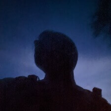

**Who am I anyway? Why does this page exist?**

> Here I summarize a few details about myself

---

<!-- raw html -->





### As mentioned at the beginning...

...my real name is Robin. For many years I have been on the internet under the alias 'xelayz'. to share my thoughts in forums, on video portals or completely different platforms. Currently I am in my 20's and live in a smaller town in Germany/NRW. The topics of computers and technology in general have been with me for ages, as I have a special liking for them. It is a lot of fun for me to deal with things from these topics, because this world seems to be endless and there is always something new to discover. On the subpage [Projects](/en/projects/) I have listed some projects, which have arisen from this passion for technology.

### Privacy

In addition, I have shown a special interest in the topic of data protection for several years now, which is why I consistently avoid some services or even use services precisely because they are the data protection-friendly equivalent. If you have the desire in your head that my data should stay with me, you can't really avoid to become active yourself and run your own services over which you have full control. Some of these services can be found on the subpage [Services](/en/services). For people who are open to data protection, you can also find some good alternatives to previous, not too data protection-friendly services on the [Recommendations](/en/suggestions) page.

### Other interests

Besides being interested in hardware, electricity, and ones and zeros, I actually have other interests that I pursue. I like to be on my own and explore the world with my car, my eBike, or even on foot. I love eating delicious food in restaurants in foreign places, reading a book on my eReader in the great outdoors or being there for other people at a distance.

Another subpage on my homepage is my personal [Blog](/en/blogs). There I share my experiences and thoughts on certain topics. If you are interested, you are welcome to drop by there. :)
