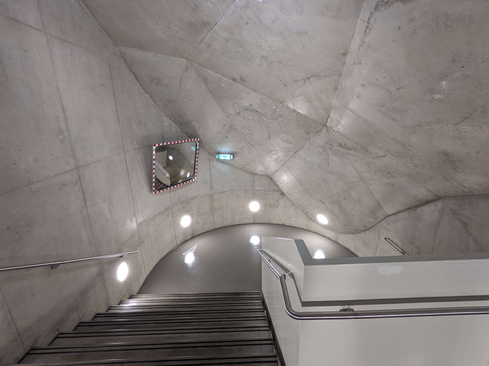

Today I visited the House of Art in Graz, which from the outside is already an art in itself. The current exhibition deals with possible and impossible futures. Among other things, interesting living concepts or building materials of the future can be seen there.

The topic or the things exhibited there didn't quite pick me up, to be honest. Only a fraction really gained my interest through information or well-staged art. This will probably be partly due to the fact that my expectations of an art building that is already so impressive from the outside were clearly too high. For example, unspectacular posters on the walls were not part of my expectations.

Nevertheless, I found one small detail particularly interesting, which prompted me to share it here. It wasn't even part of the exhibition and I can't really explain why I find it so exciting. Maybe just because it came so unexpectedly when I was trying to change floors in the stairwell of the building.

A traffic mirror, which does not reflect and only shows the stairwell without the visitors:

