Around 3 weeks I have now lived in and out of my car. Before that, I've stayed in my car more than once, alone and with one other person. But never over a longer period of time.

### Idea

At the end of July I decided to start a longer trip to clear my head and to see new beautiful things. The destination I set for myself was southern Germany and Austria. It was out of the question for me to stay every night in a hotel, because the cost would position itself at 3 weeks between 1,500-2,000€. So the whole trip would then certainly cost 2,500-3,000€ when you factor in things like food, fuel costs and attractions. As someone who often saves the drink in the restaurant, because drinks are always way too overpriced, it was also out of the question for me to pay vast amounts of money for just a place to sleep.

### Sleeping place

My accommodation for the entire 3 weeks would then become my car. I knew from previous nights in my car that it was not too comfortable and I would have to improve this situation to survive these 3 weeks. Since I own a sedan and not a van, the floor is not exactly level with the seats down. I learned from a forum that I can easily remove the rear seats so that the backrests can be folded down a bit further to make the cargo area a bit more level. So that was done. But now I only had a thin sleeping mat, which I could put on the cargo bed for sleeping. For a few days that would certainly have been sufficient, but not for 3 weeks of continuous use. For this reason, I ordered a mattress to fit my car. I selected the lowest possible height. Because mattresses are often very thick, but I could not use in the car, because the space in the car is very precious and should not be taken only by the mattress.

### Privacy

So the basic framework of my sleeping place was already completed. Now I had to think about everything around it. One important point was my privacy. I didn't want to be observed while sleeping. Also for the reason that I did not want to be recognized as a camper. My windows already have a tint of 85%, which was not enough for me. Fortunately, I then found on the Internet a sunscreen set for my windows in the car. However, even the sunshade still let light inside, which would have allowed me to be seen. For this reason, I bought an aluminum sunshade cover, which is usually placed on the front windshield to keep the car as cool as possible. I wanted to take advantage of this effect in addition to the privacy screen. My plan was to cut this cover to fit my sunshade kit and sew it on there. Since my skills in crafting and sewing are not really good, I turned to a nice seamstress from my city. She then cut and sewed everything to me. The result was perfect, much better than expected. I wanted to show this satisfaction by tipping her, since the regular price for this seemed outrageously low to me. Unfortunately, she refused any tip, so I left her a review on Google instead.

So now I could check off the windows as well. However, there was still a privacy screen missing from the front. Previously, I have always solved this privacy by any jackets, which I then clamped between the front seats. But that was no longer an option for me, I wanted a better solution. In the end, I ended up with an extendable curtain rod, which I could clamp at the two ends each to such a hook in my car. It did not hold perfectly and would certainly have fallen out again from time to time while driving, which is why I had fixed the two ends still with some plasticine. Now I was still missing a curtain. For this I bought a light-proof blue fabric, which I then had sewn by another seamstress, for this time an outrageously high price, to a curtain.

### Food

Now I was worried about my provisions, such as food, washing stuff and clothes. For my clothes I took a larger suitcase, more specifically a Dakine Split Roller EQ with 75 liters volume. In addition then two Dakine EQ Duffle bags with 50 liters volume each. In one bag I had stored my washing stuff and the other held part of my food and things like cutlery and plates. Refrigerated food was something I wanted to have with me at all times, though, so I had to figure out the best way to implement that. Since we still had summer, I had to keep in mind that my car could warm up a lot. Therefore, normal coolers have already fallen away. It had to be a cooler with compressor, which could theoretically also freeze food. I then decided on the "Dometic CoolFreeze CDF 18" cooler, which fit well behind the passenger seat due to its compact format. The cooler was operated via the 12V connection in the trunk, which I then also had switched to continuous current, so that the cooler also cools when the car is not running.

### Air exchange

I also had to think about how to get air at night when sleeping. Theoretically, with the windows and doors closed, the minimal air exchange would be enough for one person, but I didn't want to take any chances. It happened to me once with two people that we woke up completely foggy because we had breathed away all the oxygen in the car during the night. That was really not nice and can quickly become life-threatening. Since my car has a sunroof, I wanted to provide this way for a better air exchange. I was able to raise the sunroof, which prevented water from entering the interior during light rain. To protect myself from insects, I cut myself a net, which I then attached to the sunroof with magnets.

### Start

With that, I was ready to go. I had now provided for everything that one needs so to live. In order to find now and then also reasonably place at the wayside, I took additionally another camping chair and a folding table. Entertainment electronics I had of course also with me, as well as a Europe-wide Unlimited Internetflatrate.

The journey should begin with the German Alpine road, which then leads me to the Austrian border. Started then so near Lindau on Lake Constance. I arrived there very late, which is why I could only visit the place in the dark. The time before I had my driver's license, I could never understand how you can be so broken from driving ... But I clearly felt that on that day. That's why I then looked for a place to spend the night via the apps "park4night" and "Truck Parking". Unfortunately, there was no good place nearby, so I had to drive a bit. In the end I reached a beautiful little village. There was a public parking lot where you could spend a night. Unfortunately, the night was not really nice, because I was still too nervous to sleep, since it was also my first night since ages back in the car. As if that wasn't enough, the local church had to make itself known to me every 15 minutes, even in the middle of the night.

The next morning, however, I didn't let my tiredness get the best of me and took a little walk around the town to wake up a bit. I was really forced to discover many things, since I was in some place I didn't know right after I woke up. So it was not possible to lie in bed until 12 o'clock and then go from bed to the living room to my PC. The sun banged on my car every morning, creating heat that never let me sleep longer than 9 o'clock. But that's exactly what I liked, always being under power and experiencing things.

### Showering and washing clothes

After three days I felt the urge to take a shower again. I delayed it a bit, because I could only use showers at rest stops. Since I have never done this before, I was a bit afraid of it. I paid 3€ at a German rest stop. I got the key to the shower and could shower as long as I wanted. Awesome! For only 3€ I could use the shower and finally leave it again with a clean feeling. I would have imagined it worse and more expensive. However, I must say that the German showers do not seem really hygienic. Accordingly, I also showered only with slippers. In Austria, however, the showers were a dream. But this is probably due to the fact that their rest stops are financed quite differently than in Germany.

Of course I had to wash then also times my laundry. So I had to visit a laundromat for the first time. In the city of Graz in Austria I found a nice salon, which also looked nice and clean. I ended up paying about 9€ for a big load of laundry with washing and drying. I found this price to be very fair as well.

### Conclusion

I found myself liking living in the car more and more. I realized that I don't need as much to live as I just have at home. Sure, every now and then I didn't sleep perfectly in the car because it was too noisy or uncomfortable or I was annoyed that some evenings I still had to drive so long to the next place to sleep. But I would always make these compromises again, because the impressions and experiences through such a trip clearly outweigh.

In the 3 weeks I have experienced many beautiful and exhausting nights. Many exciting attractions seen, as well as great people met. I didn't have to worry much about where I would stay tomorrow, as I could linger anywhere, anytime.

In this blog entry I wanted to share my thoughts and experiences about life in the car, which is why I did not go into individual experiences of this trip now. Attached are a few pictures from the trip. Unfortunately, I didn't take any good shots where you could have seen my temporary home in the car.

### Pictures



<strong>Pictures</strong>

<a href="setup_1.jpg" target="_blank">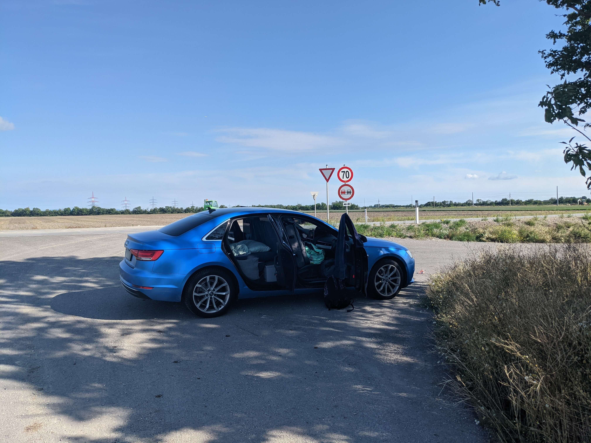</a>In this photo you can partially see some of the car interior 

<a href="setup_2.jpg" target="_blank">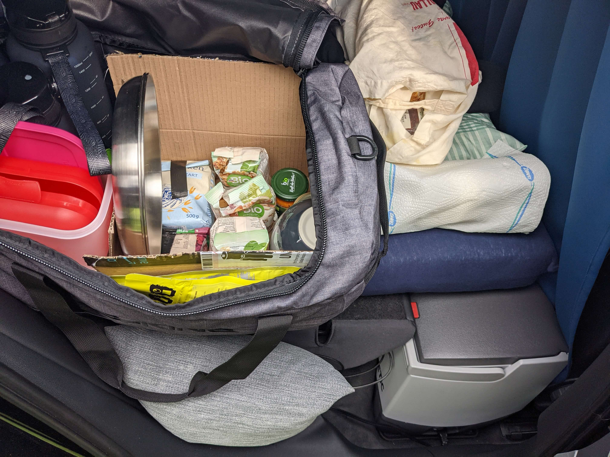</a>Here is my bag with the food and the cooler to see 

<a href="erste_nacht.jpg" target="_blank">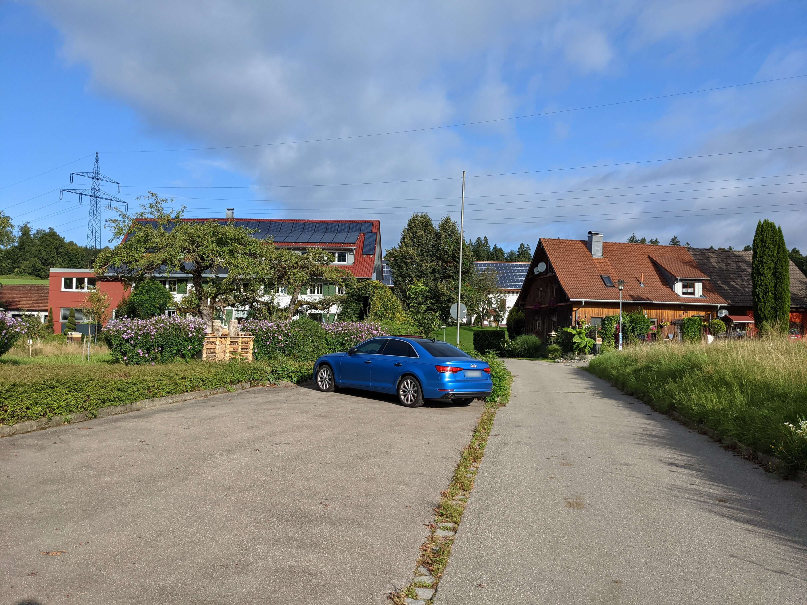</a>Pitch for the first night 

<a href="fruehstueck_1.jpg" target="_blank">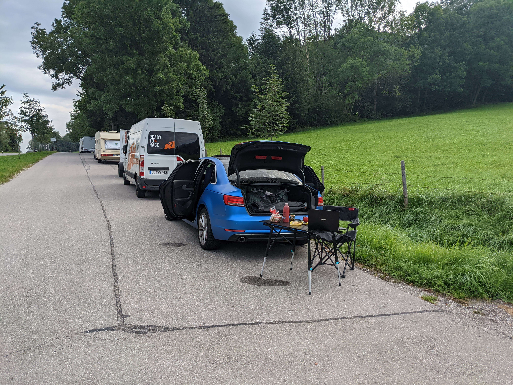</a>Breakfast at a rest area 1/2 

<a href="fruehstueck_2.jpg" target="_blank">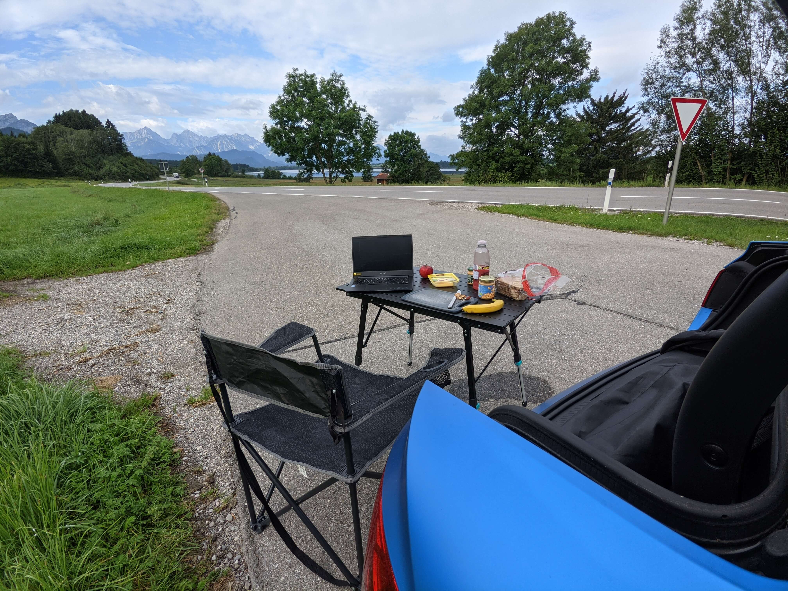</a>Breakfast at a rest area "/2 

<a href="siebte_nacht.jpg" target="_blank">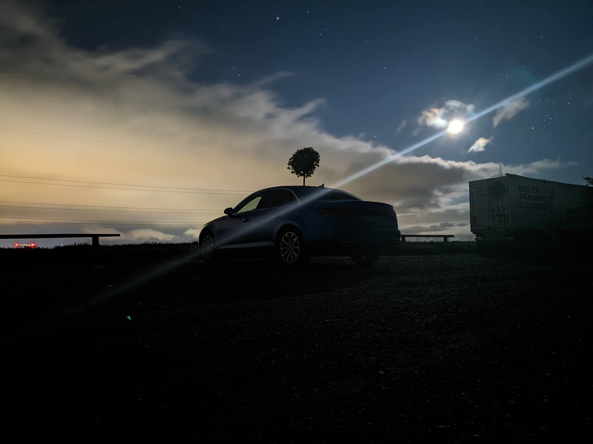</a>Pitch for the seventh night 

<a href="kunsthaus_graz.jpg" target="_blank">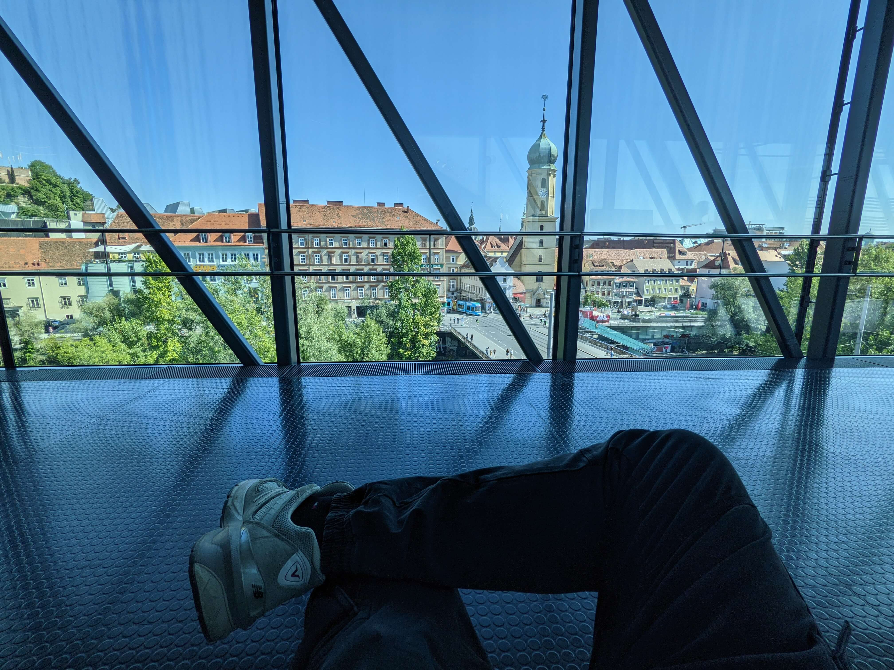</a>View of the city from the Kunsthaus Graz 

<a href="muhhh.jpg" target="_blank">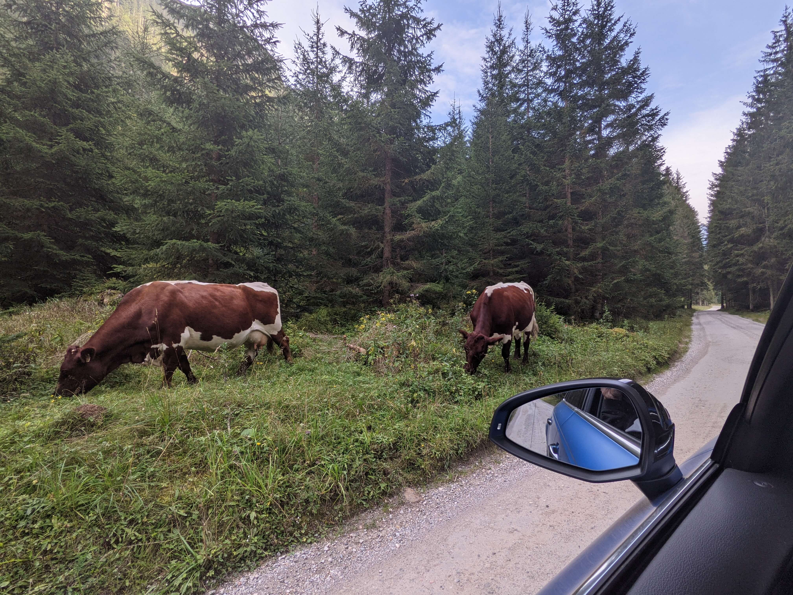</a>On the way to the Oberhüttensee 

<a href="vierzehnte_nacht.jpg" target="_blank">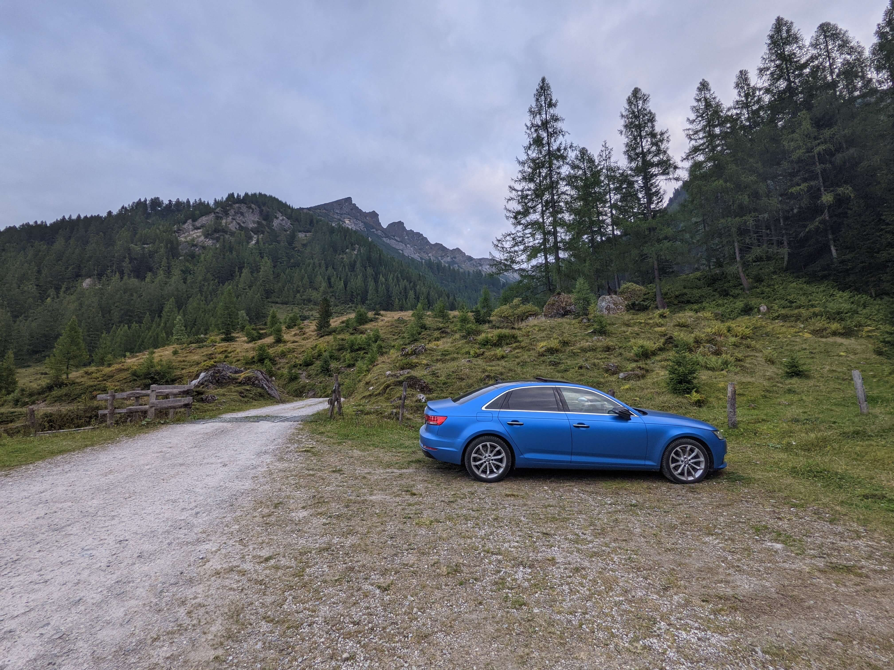</a>Sleeping place below the Oberhüttensee 

<a href="wandern.jpg" target="_blank">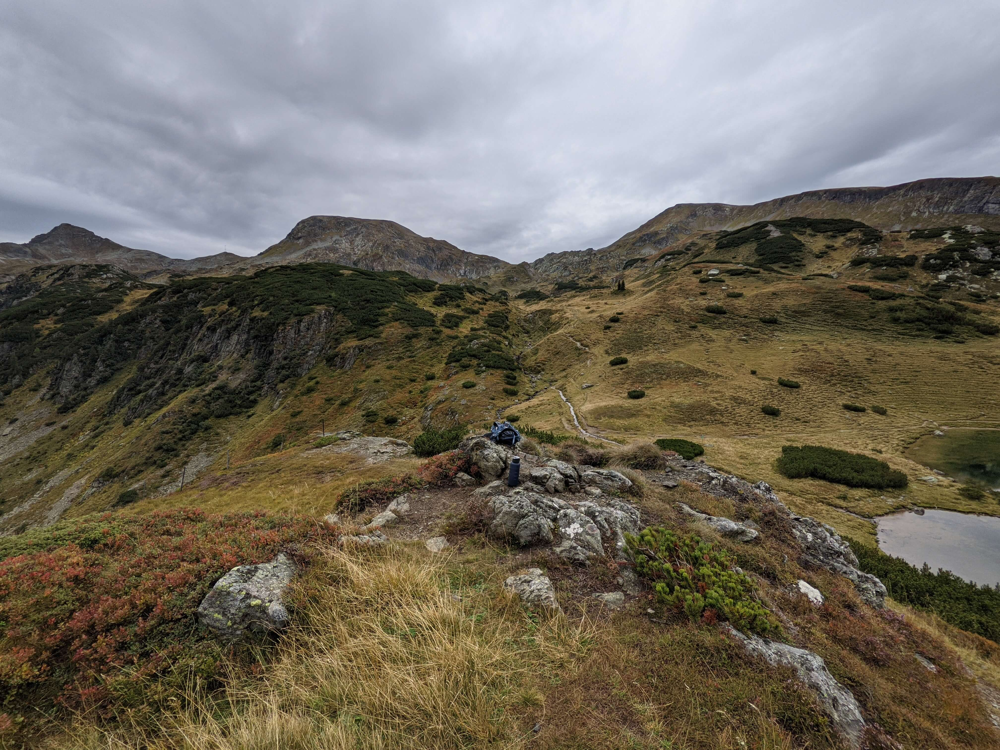</a>Hiking at the Oberhüttensee 

<a href="wolken.jpg" target="_blank">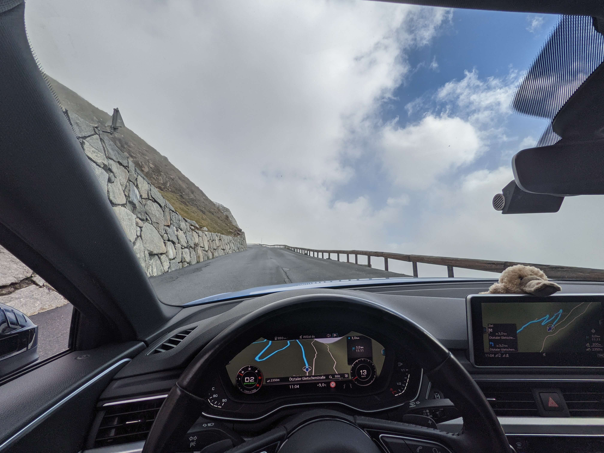</a>Next Station: Clouds 

<a href="hoechster_strassenpunkt.jpg" target="_blank">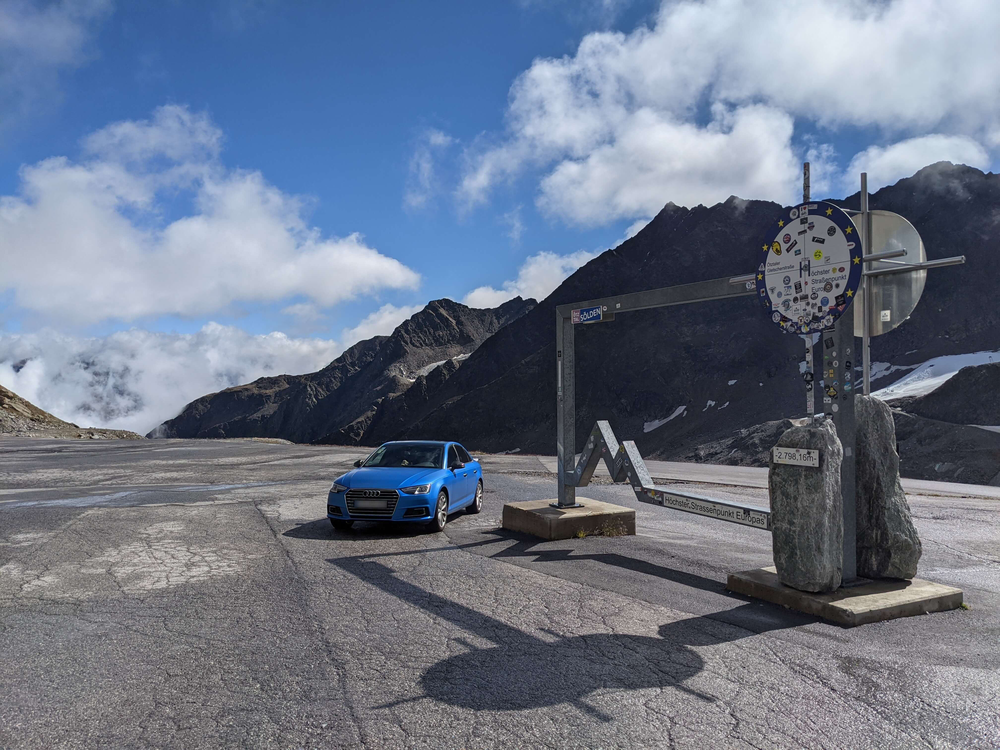</a>Highest road point in Europe 

<a href="wildspitze.jpg" target="_blank">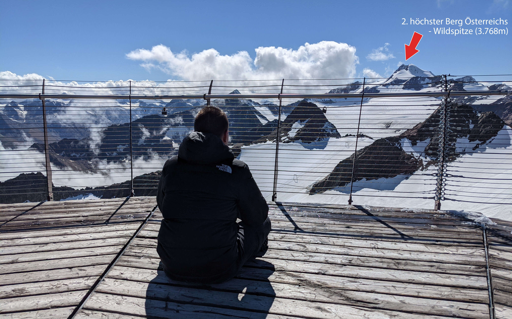</a>View of the second highest mountain in Austria

  


