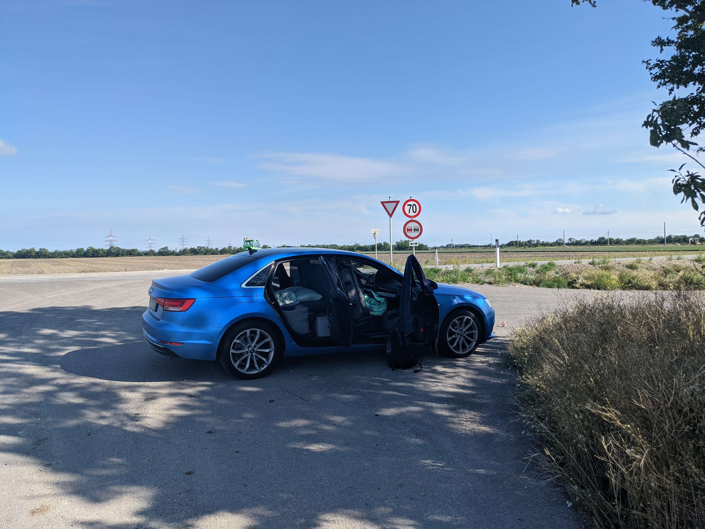
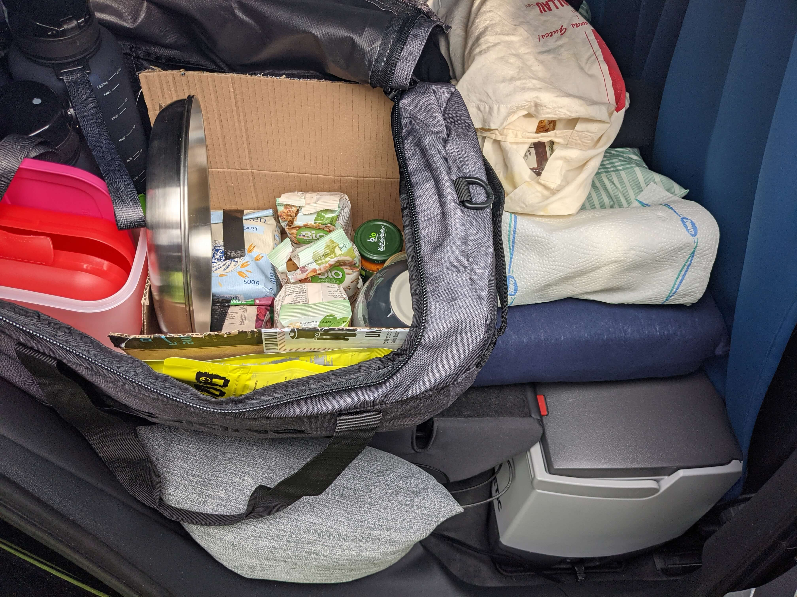
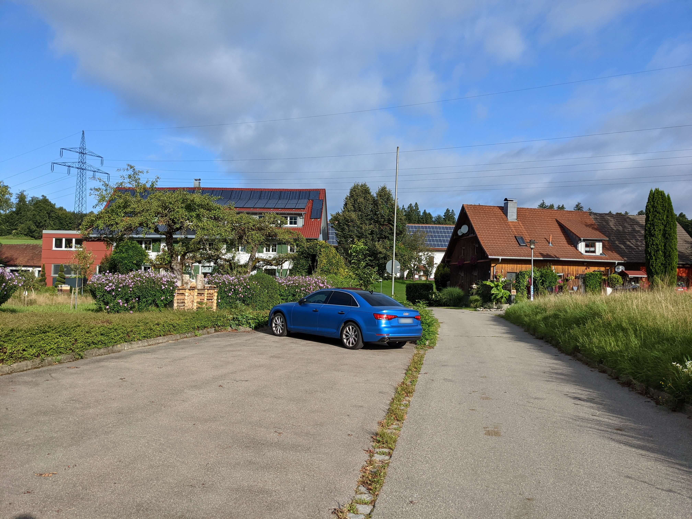
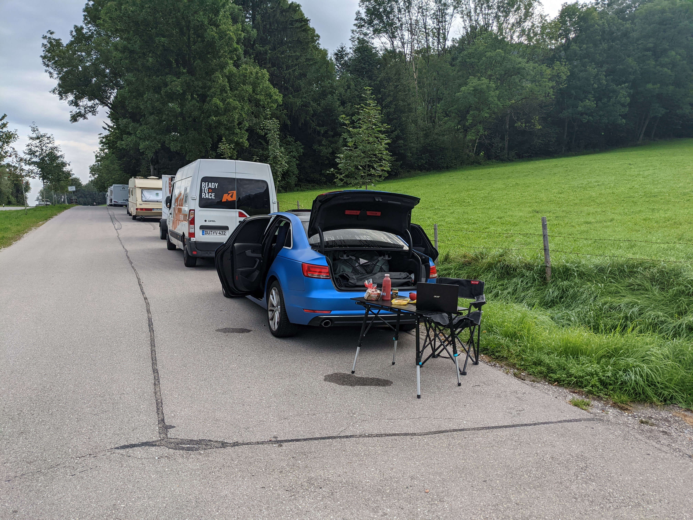
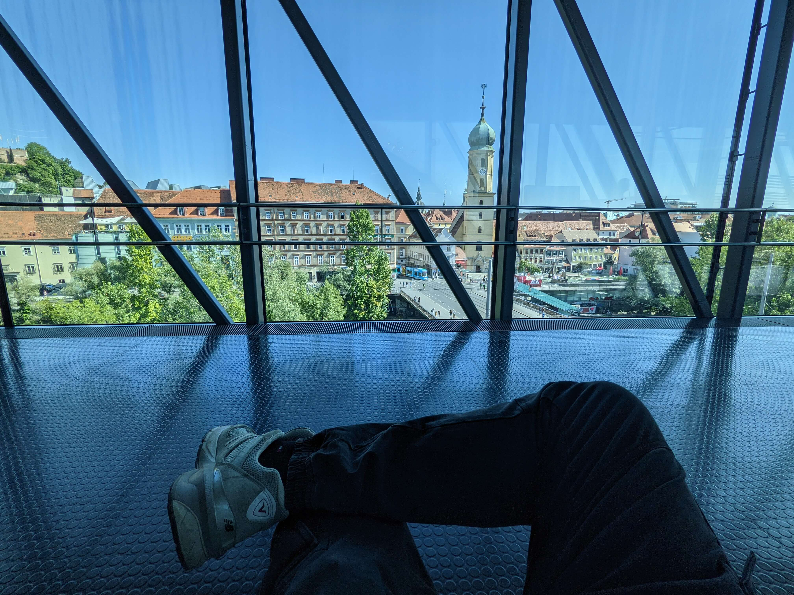
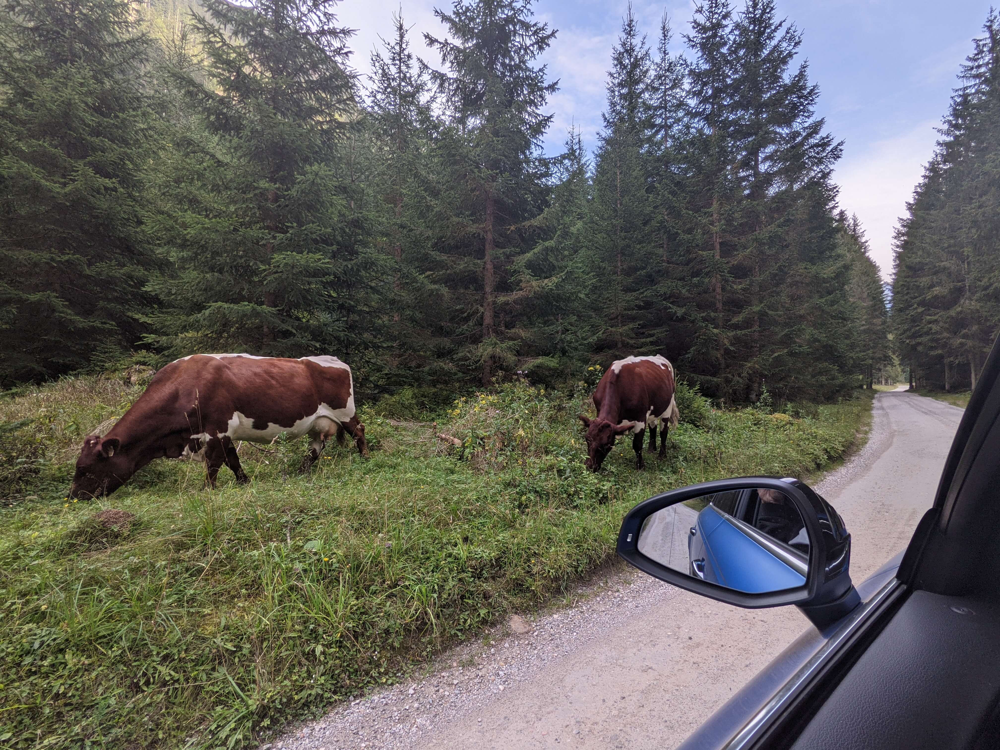
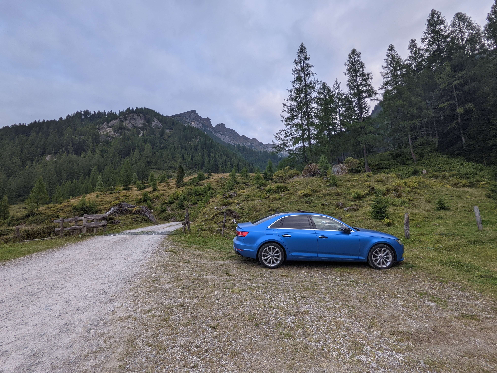
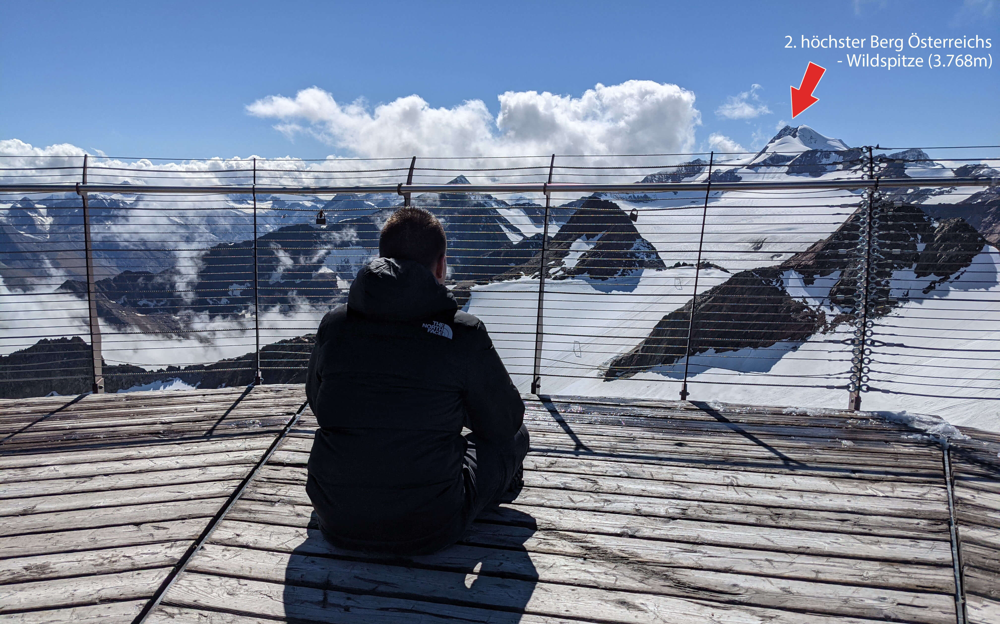

Um die 3 Wochen habe ich nun in und aus meinem Auto gelebt. Zuvor habe ich schon öfter im Auto übernachtet, alleine und mit einer weiteren Person. Doch nie über einen längeren Zeitraum hinweg.

### Idee

Ende Juli habe ich mir vorgenommen, eine längere Reise zu starten, um den Kopf freizubekommen und um neue schöne Dinge zu sehen. Als Ziel habe ich mir das südliche Deutschland und Österreich gesetzt. Es kam für mich nicht infrage, jede Nacht in einem Hotel zu übernachten, da die Kosten sich bei 3 Wochen zwischen 1.500-2.000€ positionieren würden. Der ganze Trip würde dann also sicherlich 2.500-3.000€ kosten, wenn man noch Dinge wie Verpflegung, Spritkosten und Attraktionen mit einberechnet. Als jemand der sich im Restaurant oft das Getränk spart, da Getränke immer viel zu überteuert sind, kam es für mich auch nicht infrage Unmengen an Geld für nur einen Schlafplatz zu zahlen.

### Schlafplatz

Meine Unterkunft für die gesamten 3 Wochen würde dann also mein Auto werden. Aus vorherigen Nächten in meinem Auto wusste ich, dass es nicht allzu bequem war und ich diese Situation verbessern müsste, um diese 3 Wochen überleben zu können. Da ich eine Limousine und keinen Kombi besitze, ist der Boden bei heruntergeklappten Sitzen nicht gerade ebenerdig. In einem Forum habe ich erfahren, dass ich die hinteren Sitzflächen ganz einfach ausbauen kann, damit die Rückenlehnen noch ein Stück weiter nach unten geklappt werden können, um die Ladefläche etwas ebenerdiger zu gestalten. Das war dann also schon mal geschafft. Nun besaß ich aber nur eine dünne Isomatte, welche ich auf die Ladefläche zum Schlafen legen könnte. Für ein paar Tage wäre die sicherlich ausreichend gewesen, doch nicht für 3 Wochen Dauerbenutzung. Aus diesem Grund habe ich mir eine Matratze passgenau für mein Auto bestellt. Ausgewählt habe ich die niedrigste mögliche Höhe. Denn Matratzen sind oft sehr dick, was ich aber im Auto nicht gebrauchen konnte, da der Platz im Auto sehr kostbar ist und nicht nur von der Matratze eingenommen werden sollte.

### Privatsphäre

Das Grundgerüst meines Schlafplatzes war damit also bereits fertiggestellt. Jetzt musste ich mir Gedanken um alles drum herum machen. Ein wichtiger Punkt war noch meine Privatsphäre. Ich wollte ungern beim Schlafen beobachtet werden können. Auch aus dem Grund, da ich nicht als Camper erkannt werden wollte. Meine Scheiben besitzen bereits eine Tönung von 85%, was mir aber nicht ausreichte. Glücklicherweise habe ich dann im Internet ein Sonnenschutz-Set für meine Scheiben im Auto gefunden. Doch auch der Sonnenschutz hat noch Licht in das Innere gelassen, wodurch man mich hätte sehen können. Aus diesem Grund habe ich mir eine Sonnenschutzabdeckung aus Alu gekauft, welche üblicherweise vorne auf die Frontscheibe gelegt wird, um das Auto möglichst kühl zu halten. Diesen Effekt wollte ich mir neben dem Sichtschutz zunutze machen. Mein Plan war es, dass ich diese Abdeckung auf mein Sonnenschutz-Set passend zuschneide und dort dran nähe. Da meine Fähigkeiten im Bereich Basteln und Nähen nicht wirklich gut sind, habe ich mich an eine nette Näherin aus meiner Stadt gewandt. Sie hat mir dann alles zugerechtgeschnitten und genäht. Das Ergebnis war perfekt, viel besser als erwartet. Diese Zufriedenheit wollte ich auch durch ein Trinkgeld zeigen, da mir der reguläre Preis dafür unverschämt niedrig vorkam. Leider hat sie jegliches Trinkgeld verweigert, weshalb ich ihr stattdessen eine Bewertung bei Google hinterlassen habe.

Die Fenster konnte ich nun also auch abhaken. Es fehlte jedoch noch ein Sichtschutz nach vorne hin. Früher habe ich diesen Sichtschutz immer durch irgendwelche Jacken gelöst, welche ich dann zwischen die vorderen Sitze geklemmt habe. Das kam für mich aber nicht mehr infrage, ich wollte eine bessere Lösung. Am Ende bin ich dann bei einer ausziehbaren Gardinenstange gelandet, welche ich an den beiden Enden jeweils an so einen Haken in meinem Auto einklemmen konnte. Es hat nicht perfekt gehalten und wäre sicherlich bei der Fahrt auch ab und an wieder herausgefallen, weshalb ich die beiden Enden noch mit etwas Knete fixiert hatte. Nun fehlte mir noch eine Gardine. Dafür kaufte ich mir einen lichtdichten blauen Stoff, welche ich dann von einer anderen Näherin, für diesmal einen unverschämten hohen Preis, zu einer Gardine nähen ließ.

### Verpflegung

Nun machte ich mir Gedanken um meine Verpflegung, wie Lebensmittel, Waschzeug und Kleidung. Für meine Kleidung habe ich einen größeren Koffer genommen, genauer gesagt einen Dakine Split Roller EQ mit 75 Liter Volumen. Zusätzlich dann noch zwei Dakine EQ Duffle Taschen mit je 50 Liter Volumen. In der einen Tasche hatte ich mein Waschzeug eingelagert und die andere fasste ein Teil meiner Lebensmittel und Dinge wie Besteck und Teller. Gekühlte Lebensmittel wollte ich aber auch immer dabei haben, weshalb ich mich schlaumachen musste, wie ich das am besten umsetze. Da wir noch Sommer hatten, musste ich beachten, dass sich mein Auto stark aufwärmen könnte. Daher sind normale Kühlboxen schon mal weggefallen. Es musste eine Kühlbox mit Kompressor sein, welche theoretisch auch Lebensmittel einfrieren könnte. Entschieden habe ich mich dann für die "Dometic CoolFreeze CDF 18" Kühlbox, welche durch ihr kompaktes Format gut hinter den Beifahrersitz passte. Betrieben wurde die Kühlbox über den 12V-Anschluss im Kofferraum, welchen ich dann auch noch auf Dauerstrom umstellen lassen habe, damit die Kühlbox auch kühlt, wenn das Auto mal nicht läuft.

### Luftaustausch

Außerdem musste ich mir noch Gedanken machen, wie ich nachts beim Schlafen Luft bekomme. Theoretisch würde der minimale Luftaustausch bei geschlossenen Fenstern und Türen für eine Person ausreichen, doch ich wollte kein Risiko eingehen. Zu zweit ist es mir einmal passiert, dass wir ganz benebelt aufgewacht sind, weil wir über die Nacht den ganzen Sauerstoff im Auto weggeatmet hatten. Das war dann echt nicht schön und kann dann auch ganz schnell lebensgefährlich werden. Da mein Auto ein Schiebedach besitzt, wollte ich über diesen Weg für einen besseren Luftaustausch sorgen. Dieses konnte ich hochfahren, wodurch bei schwachem Regen auch kein Wasser ins Innere gelangen konnte. Um mich vor Insekten zu schützen habe ich mir ein Netz zusammengeschnitten, welches ich dann mit Magneten am Schiebedach befestigt habe.

### Beginn

Damit war ich dann startbereit. Ich hatte nun für alles gesorgt, was man so zum Leben benötigt. Um ab und an auch mal vernünftig am Wegrand Platz zu finden, habe ich zusätzlich noch einen Camping-Stuhl und einen zusammenfaltbaren Tisch mitgenommen. Unterhaltungselektronik hatte ich natürlich auch dabei, sowie eine europaweite Unlimited Internetflatrate.

Die Reise sollte mit der deutschen Alpenstraße beginnen, welche mich dann bis zur österreichischen Grenze führt. Begonnen wurde dann also bei Lindau am Bodensee. Dort kam ich erst sehr spät an, weshalb ich den Ort dann auch nur noch bei Dunkelheit besichtigen konnte. Die Zeit bevor ich meinen Führerschein hatte, konnte ich nie verstehen, wie man vom Autofahren so kaputt sein kann ... Doch das habe ich an dem Tag deutlich zu spüren bekommen. Deshalb suchte ich mir dann über die Apps "park4night" und "Truck Parking" einen Platz zum Übernachten heraus. Leider gab es keinen guten Platz in der Nähe, weshalb ich noch ein bisschen fahren musste. Am Ende erreichte ich dann ein wunderschönes kleines Dorf. Dort befand sich ein öffentlicher Parkplatz, auf welchem man eine Nacht verbringen konnte. Leider war die Nacht nicht wirklich schön, da ich noch zu nervös zum Schlafen war, da es eben auch meine erste Nacht seit Ewigkeiten wieder im Auto war. Als wäre das nicht genug gewesen, musste sich auch noch die örtliche Kirche alle 15 Minuten bei mir bemerkbar machen, selbst mitten in der Nacht.

Am nächsten Morgen habe ich mich aber nicht von meiner Müdigkeit einnehmen lassen und habe einen kleinen Spaziergang durch den Ort gemacht, um etwas wacher zu werden. Ich war regelrecht gezwungen viele Dinge zu entdecken, da ich mich direkt nach dem Aufstehen in irgendeinem Ort befand, welchen ich nicht kannte. Es war also nicht möglich bis 12 Uhr im Bett zu liegen, um mich dann vom Bett auf ins Wohnzimmer zu meinem PC zu begeben. Die Sonne knallte jeden Morgen auf mein Auto, wodurch sich Wärme entwickelte, welche mich nie länger als 9 Uhr schlafen lassen hat. Aber genau das mochte ich, immer unter Strom zu stehen und Dinge zu erleben.

### Duschen und Wäsche waschen

Nach drei Tagen habe ich dann das Verlangen gespürt mal wieder zu duschen. Ich habe es etwas hinausgezögert, da ich eben nur Duschen an Raststätten benutzen konnte. Da ich das noch nie gemacht habe, habe ich mich etwas davor gescheut. Gezahlt habe ich 3€ an einer deutschen Raststätte. Ich bekam den Schlüssel zur Dusche und konnte so lange duschen, wie ich wollte. Wahnsinn! Für nur 3€ konnte ich die Dusche benutzen und abschließend mit einem sauberen Gefühl diese wieder verlassen. Ich hätte es mir schlimmer und teurer vorgestellt. Allerdings muss ich sagen, dass die deutschen Duschen nicht wirklich hygienisch wirken. Dementsprechend habe ich auch nur mit Schlappen geduscht. In Österreich waren die Duschen aber ein Traum. Dies liegt aber wohl daran, dass sich deren Raststätten ganz anders als in Deutschland finanzieren.

Natürlich musste ich dann auch mal meine Wäsche waschen. Ich musste also zum ersten Mal einen Waschsalon besuchen. In der Stadt Graz in Österreich habe ich dann einen schönen Salon gefunden, welcher auch schön neu und sauber wirkte. Gezahlt habe ich am Ende ca. 9€ für eine große Ladung Wäsche mit Waschen und Trocknen. Auch diesen Preis habe ich als sehr fair empfunden.

### Fazit

Ich habe immer mehr Gefallen an einem Leben im Auto gefunden. Mir wurde bewusst, dass ich gar nicht so viel zum Leben benötige, wie ich es eben zu Hause habe. Klar habe ich ab und an mal nicht perfekt im Auto geschlafen, weil es zu laut oder unbequem war oder ich genervt war, dass ich manche Abende noch so lange zum nächsten Schlafplatz fahren musste. Doch diese Kompromisse würde ich immer wieder eingehen, da die Eindrücke und Erlebnisse durch solch eine Reise deutlich überwiegen.

In den 3 Wochen habe ich viele schöne und anstrengende Nächte erlebt. Viele spannende Attraktionen gesehen, sowie tolle Leute kennengelernt. Ich musste mir nicht groß Gedanken machen, wo ich mich morgen aufhalten werde, da ich überall, zu jederzeit verweilen konnte.

In diesem Blog Eintrag wollte ich meine Gedanken und Erlebnisse zum Leben im Auto teilen, weshalb ich jetzt nicht auf einzelne Erlebnisse dieser Reise eingegangen bin. Anbei noch ein paar Bilder von der Reise. Leider habe ich keine guten Aufnahmen gemacht, auf denen man mein temporäres Zuhause im Auto hätte sehen können.

### Bilder



<strong>Bilder</strong>

Auf diesem Foto kann man teilweise etwas von der Inneneinrichtung sehen 

Hier ist meine Tasche mit den Lebensmitteln und die Kühlbox zu sehen 

Stellplatz für die erste Nacht 

Frühstück an einem Rastplatz 1/2 

Frühstück an einem Rastplatz 2/2 

Stellplatz für die siebte Nacht 

Aussicht aus dem Kunsthaus Graz auf die Stadt 

Auf dem Weg zum Oberhüttensee 

Schlafplatz unterhalb vom Oberhüttensee 

Wandern am Oberhüttensee 

Nächste Station: Wolken 

Höchster Straßenpunkt Europas 

 Aussicht auf den zweithöchsten Berg Österreichs

  


