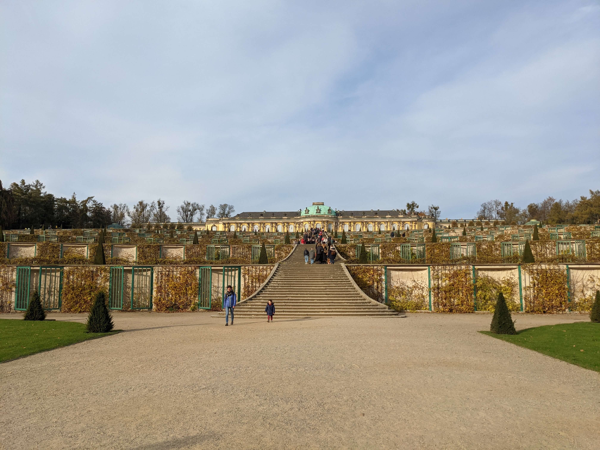
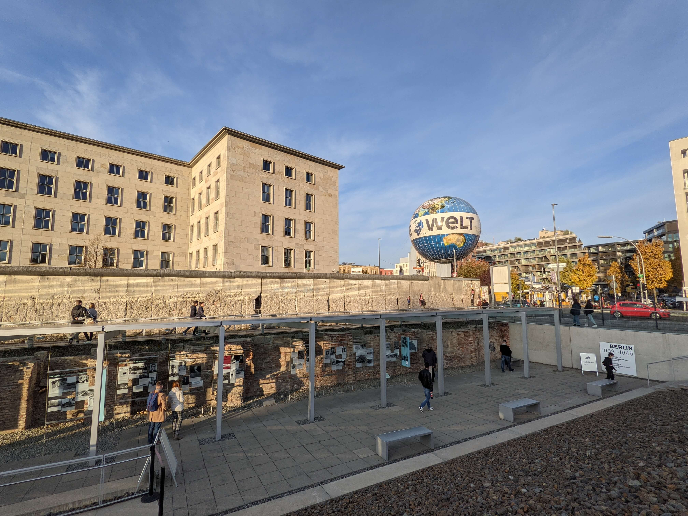
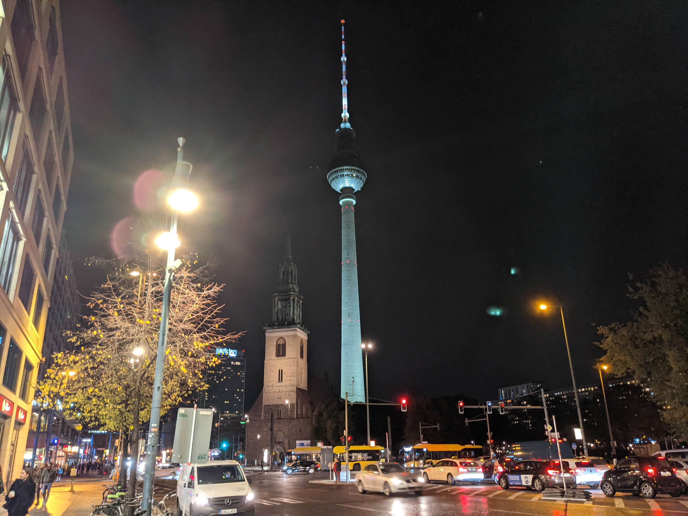
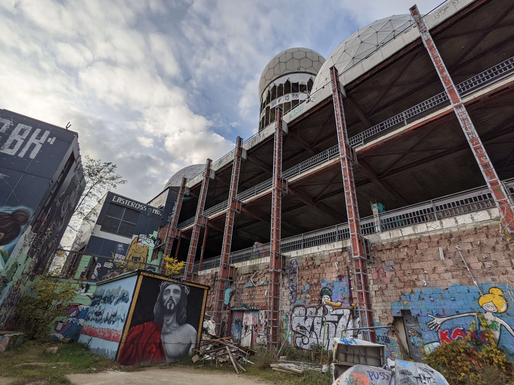
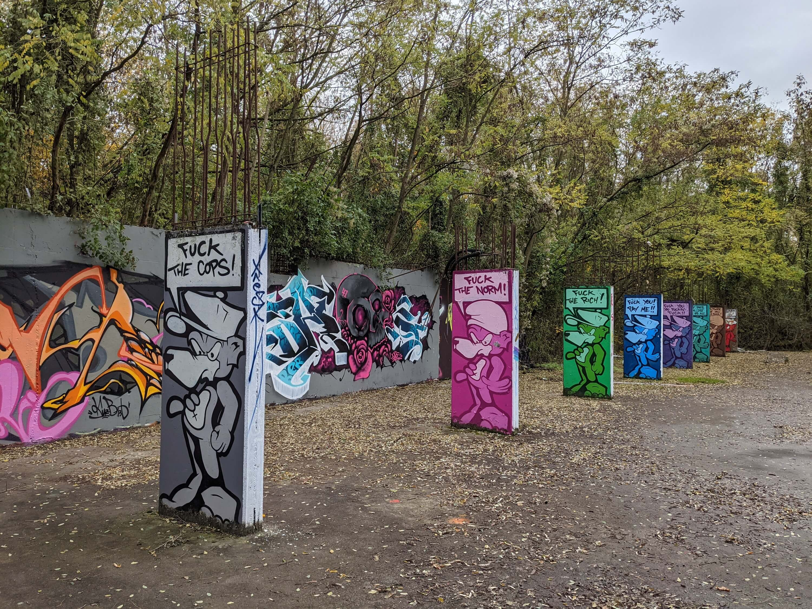

From 30.10 - 03.11 I stayed in Berlin to explore the city a little more and to go out to eat in delicious restaurants. The last time I was in 2014 due to the graduation trip of my school in Berlin. We saw a lot there too, but there's a lot more to discover in such a big city than we could have fit into a few days back then.

### Day 1 - Stop in Potsdam

Early in the morning, I left with my car and then took the A2 towards Berlin. Since my car had unfortunately been under a tree the previous night, which caused a strange mass to rain down on my car, I also had to visit a car wash. I had chosen a car wash in Potsdam, because I had a voucher for it. Arrived at the car wash was already waiting a man in front of this, which had also donated a wash to his car. I saw that his car had a Potsdam license plate, which is why I approached the man and asked him if he could tell me as a Potsdamer what you must have seen here in Potsdam. After my car was then clean again, it went directly to the castle Sanssouci. The man said that one would not have been seriously in Potsdam if one had not seen the castle. The castle was surrounded by a large park and many other sights. I spent an hour there looking at the park and the castle. There were many different statues in the park, often of Roman gods. Thanks to OSM, I was able to get all the details about the statues directly from my map on my smartphone, so I always knew what they represented or meant.

Then I set off again in the direction of Berlin. I took a small detour, because the man from the car wash had recommended the Glienicker Bridge. There ran at that time the border between the GDR and the FRG. And this bridge was at that time an important place to exchange agents or prisoners. It was a very nice bridge and after a few seconds it was already behind me, while I was now without further detours in the direction of Berlin.

Arrived at the hotel, I rested a bit until I got hungry and went on foot to a nearby Italian restaurant. After I then couldn't pay with card and also had problems at the ATM because I didn't realize that I had to withdraw at least 50€ with my credit card, I went back to the hotel to go to sleep.

### Day 2 - Scammer!

On the second day of my Berlin trip I decided to just walk a bit through Berlin without having an exact plan. I was able to see many worth seeing details during my walk through Berlin. I also passed larger sights such as Potsdamer Platz with the Sony Center, the Brandenburg Gate and Checkpoint Charlie. Near the Brandenburg Gate I sat down with my notebook on a staircase to do a few things. After a short time I was approached by a man who told me that he came from Austria and was only here for a short time for his work in construction. Unfortunately, he has lost all his things and he needs 17.50 € for the night in a hostel, before he then the next day then again on the way home. First I did not believe this man of course. Then I wanted proof that he actually comes from Austria - his dialect was not proof enough for me. Thereupon he could call me all localities of a small village in Austria, whereby this then man had won then ever more my confidence. He wanted me to write him my bank details on a piece of paper so that he could transfer the money in the next few days. I did that and then also gave him 20€. Since my distrust was still partly present, I followed this man at a distance and observed. I wanted to know what he would do next and whether he would not approach other people with this scam. If he had done this, I would have confronted him and got my 20€ back. 500 meters further on, he was talking to another man. I saw that the man from Austria gave the other man my card with the bank details. I thought that maybe the other man was the boss of the scammer and that he had to give the 20€ to him. From my distance, however, I could not quite see it. After the distanced themselves then again I have made myself then the other man. I demanded my note with the bank account back, but this was then visibly overwhelmed with the situation. I saw then also that this man must be homeless from the appearance. He then said to me that he did not know this man and he only gave him this piece of paper, he looked at it briefly and then the Austrian tore the piece of paper out of his hand again and threw it away. I believed this man. By this action I lost unfortunately the actual scammer from the eyes. The other man told me that the Austrian had turned right at the back, but there at the back right was the Brandenburg Gate ... and there were extremely many people there. So he could successfully disappear and I had no chance to discover him and to confront him. A little bit I was annoyed then. Not really because of the 20€, only that I lost sight of this man. This should not have happened to me, because he was the real scammer and the other one was just an uninvolved person.

Then it was already dark while I was wandering around somewhere in the Kreuzberg district. The hunger made itself felt, but I could not decide where I go to eat or whether I still want to explore something. While I stood then together with a advertising column at a larger crossing and the traffic lights had already several red-green circuits behind itself, came all at once two men on me, which had just passed the crossing. They quickly revealed themselves to me as believers, which wanted to bring me closer to their faith. Since I was just without a plan anyway, I kindly agreed to listen to their message. In general, I am quite open to such things, even though it is very likely that I will not adopt their faith. However, I am interested in all the stories and backgrounds, because I can understand the believers better and such information is also part of our past, because at that time many people were part of a larger faith community. Topic of this hour (or the 15 minutes ...) was then that there is not only a father in heaven, which watches over us, but also a mother. One believer then proved this with various comparisons and Bible verses, while the other man remained silent and also listened attentively. In between and at the end I asked a few questions, such as whether the prayers would then also be adapted, since one had spoken in this so far only to a father. In the end, both sides were satisfied with the respective input and output and we said goodbye after a restaurant tip for me.

The tip was rather a recommendation for a place in which I should certainly find - the Bergmannstraße. This is probably the main street in this part of town, which was accordingly also very busy. Since we had the 31.10, the streets were also still haunted by 'creepy' figures, which extorted the restaurants with 'trick or treat'. My appearance was unfortunately not spooky enough, which is why I ended up having to pay for my own food in an Indian restaurant and didn't get it for free. However, the food was also very tasty, which is why I was happy to pay for it. With a full stomach, I made my way back towards the parking garage to head back to the hotel.

To my amazement, I quickly found my way around Berlin's traffic. I was hardly overwhelmed, only took one wrong turn and was honked 0 times. Nevertheless, the Berlin traffic is special. I noticed that many people honk at other road users for no real reason or just honk to give the driver in front of you a friendly heads up about something. At least that's how I took it, as some drivers were honked at even though it wasn't obvious to me that they were doing anything wrong. In addition, pedestrians very often run over red lights, which really bothered me. In the middle of the busy city, I also saw a mother with a child running through the red light right in front of me. Probably it is so exemplified in Berlin that the red lights are rather a recommendation than a signal to which one must necessarily adhere. In addition, I would like to mention the parcel delivery people. It is insane what these people do. I don't want to imagine how stressful the parcel delivery is in such a large, narrow and busy city. Their parking skills are also really impressive. I saw a delivery man who drove into a parking space that was only a few centimeters larger than his own van. Sure, they have sensors and cameras, but it's still really good to fit into such a parking space right away with the traffic stress there.

### Day 3 - Informative & Delicious Day

After helping myself to plenty at the breakfast buffet, I dawdled around in my room for about 2 hours before heading back towards downtown Berlin. On my non-existent list was still the snack 'Mustafa's Gemüsekebap', which is supposed to make the best kebab in all of Berlin. The days before I already wanted to Mustafa, but on weekends the already long line in front of the snack bar is a bit longer. On this day, the line was not too long and I had to wait 'only' 45 minutes for my kebab, which was really very, very tasty. The kebab could have been a little bigger, but at the time it was perfect for me, because I still had my breakfast to digest.

After the small snack, we went to the GDR Museum. By the way, this museum was also recommended to me by the man from the car wash, since I also told him that I was actually on my way to Berlin. There, too, I was greeted by a queue, which also made me stand in line for another 45 minutes. All in all, I spent about 2 hours in the museum, because I had read through a lot of things in more detail and hardly skipped any texts or exhibitions. I can only highly recommend the museum. It is not just a boring museum where you only find texts with pictures. It is very interactive and I really enjoyed it. Unfortunately, of course, you can not keep everything read, but a lot of important information I could still take home.

Since the GDR Museum is located directly at the Berlin TV Tower, I walked a bit through the alleys there to enjoy the scenery with the tower something. In an adjacent café I drank then still briefly a cocoa and ate a delicious pastries with poppy or cinnamon. I don't remember exactly and in my head I always mix up both ingredients anyway. But in any case it tasted very delicious and that is the most important thing.

When I returned to the parking garage I even got a little 'present'. My parking card no longer worked and the machine always spit out the message that I should please turn the card. But it didn't help, so I had to call the service. This meant directly that I should please call again when I stand with my car in front of the barrier, then he would let me out. Saved over 10€! Many thanks!

For the evening I went to a vegan sushi restaurant. I like sushi very much and I wanted to try their vegan creations, because I already knew all the combinations with fish. I asked the waitress to put together a plate with the best rolls that they have to offer and then I really enjoyed myself with drinks and other snacks. It was really delicious! In case anyone is interested: The restaurant is called 'Secret Garden' and can be found near the 'East Side Mall'.

### Day 4 - Lost Place

On the fourth day, the Teufelsberg was on my list, which I also visited for a whole 3 hours. On one plateau of the artificial mountain, the Teufelsberg, there is a very exciting and large Lost Place. After the 2nd World War, the US Army operated a listening station there, which should monitor especially the communications from the direction of Russia. For over 20 years, this facility is abandoned, on which many street artists may live out. Accordingly, you can also find really beautiful works of art on the walls of this old facility. First I thought that this plant is completely abandoned, but it is not completely. An organization takes care of this plant and looks that not too much is broken and then also repaired if necessary essential things. For this service you pay at the entrance then 8€, which in my opinion is perfectly fine. Many beautiful works of art I could admire there and also go to the largest building of this former listening station, from which I had an impressive panoramic view of Berlin. I did not take many photos, because I prefer to take fewer photos lately, to be able to enjoy the moment better myself. In addition, there are already pictures of most things on the Internet anyway. Nevertheless, I attach 1-2 pictures to this entry, so that you can get a small impression of the views. At the exit, I had a long chat with the only full-time employee about the facility and learned many cool additional details. Really cool and nice guy!

From the Teufelsberg I went to one of the best burger places in the city. My way led past the Victory Column, where I had to wait at a red light. I stood right in front and suddenly jumped from the right a guy with torches on the crosswalk and delivered a very entertaining fire show. This came as such a surprise that I got a lot of enjoyment out of the short show. He then waved at me thankfully and I then waved back thankfully out of reflex. But then he thought briefly that I also wanted to give him money for it, since I had waved so. He then but quickly turned back and I was a little embarrassed or / and disappointed, because I had not even realized that the course not only made for my entertainment, but also to earn money with it. Can he do of course, but is then just a completely different feeling and I was then a bit taken by surprise.

The burger in one of the best burger stores was good, but now not perfect. Have in my life already eaten better burgers.

### Day 5 - Bright Spots

Last day! After breakfast, I packed up all my things and then checked out again. I didn't want to leave for home until around 5pm, as I wanted to use the half day to see two more things in and around Berlin. First, I went to the Tesla Gigafactory to see this large-scale project for myself. After only 30 minutes I was already there and finally saw the construction site live and not only through pictures from the internet. It was very impressive how many people were working there and how huge this whole area is. Trucks regularly drove back and forth through the 3 entrances and exits to bring new materials or to transport them away. I was able to get a little closer to the construction site via the adjacent wooded area. Unfortunately, at the edge of the forest runs the railroad line to the Tesla site, on which at that time was also a very long train, which had blocked my view. So I had to walk along the train to the end to get a proper view of the site.

Then I went back towards the city center, because I wanted to visit an exhibition called 'Dark Matters'. For 16€ I was allowed to see and experience 5-6 light installations, which were really extremely impressive. In addition, the light animations were accompanied by moving and bass-rich sounds, which made the whole installation even more spectacular. I don't want to tell too much, because you have to experience this exhibition yourself. It is simply a great feeling to hear and feel these light installations with the sounds - as if in another world.

At 5 pm I had to be already at a McDonalds in Berlin, because I had published my ride home at BlaBlaCar and then I was allowed to take 3 other people with me. Two of the people came on time and one was unfortunately delayed by 20 minutes. The ride with them was really really great! Two of the passengers were Syrians. One lived and studied here and the other was here through an exchange program from Georgia. The other person was probably also a foreigner, because he spoke very little German, but very good English. Overall, though, he didn't talk much and preferred to watch Netflix for the ride. I talked the most with the Syrian, who also lives here in Germany, because he could speak German normally. Really cool guy! With him I also drove the longest time, a whole 4 hours. We talked about Syria and its living conditions, which I learned a lot. In the end, we showed each other some music. He Arabic music and I German music, because he likes to learn the language with songs and he needed new recommendations. He also told me that his language teacher had recommended the song "Helene Fischer - Atemlos". Then I just laughed and he then also said that he had then always listened to that and his friends asked why he hears something like that all the time. From pop, rap, Pokémon theme songs and classical music in each German and Arabic language we heard everything. Thus, the time flew by pretty quickly and before I knew it I was already back home.



<strong>Pictures</strong>

Sanssouci Palace in Potsdam 

In the center of Berlin 

Berlin TV Tower 

Former listening station 

Fuck You! 

  


