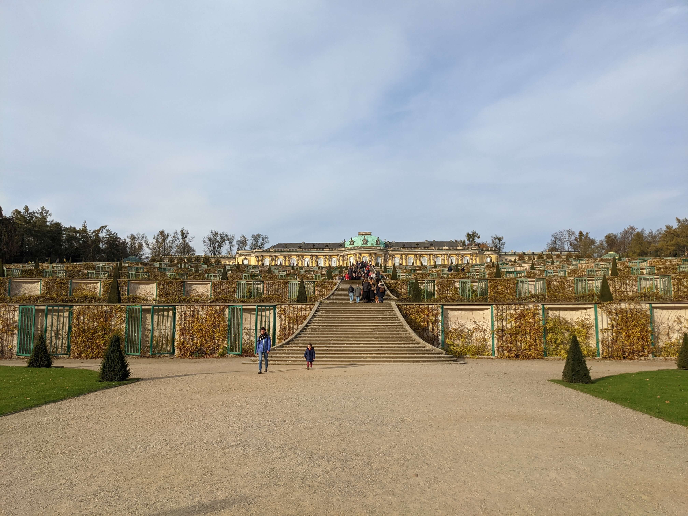
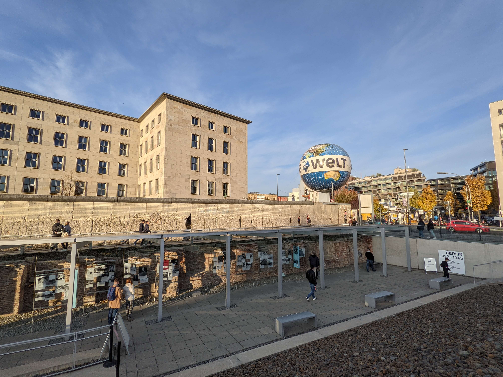
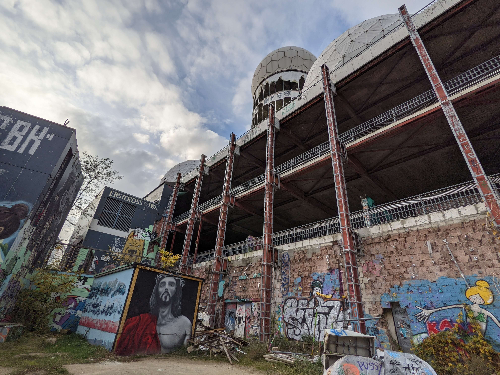

Vom 30.10 - 03.11 habe ich mich in Berlin aufgehalten, um die Stadt etwas mehr zu erkunden und um in leckeren Restaurants essen zu gehen. Das letzte Mal war ich 2014 aufgrund der Abschlussfahrt meiner Schule in Berlin. Dort haben wir zwar auch schon viel gesehen, doch in einer solch großen Stadt kann man noch viel mehr entdecken, als wir damals in wenigen Tagen hätten unterbringen können.

### Tag 1 - Halt in Potsdam

Früh am Morgen bin ich mit meinem Auto aufgebrochen, um dann über die A2 in Richtung Berlin zu fahren. Da mein Auto die vorherige Nacht leider unter einen Baum gestanden hat, welcher eine seltsame Masse auf mein Auto niederregnen lassen hat, musste ich auch noch eine Waschanlage aufsuchen. Ausgesucht hatte ich mir eine Waschanlage in Potsdam, da ich für diese einen Gutschein hatte. Angekommen an der Waschanlage wartete bereits ein Mann vor dieser, welcher seinem Auto auch eine Wäsche spendiert hatte. Ich sah, dass sein Auto ein Potsdamer Kennzeichen besaß, weshalb ich den Mann daraufhin angesprochen habe und ihn gefragt habe, ob er mir als Potsdamer sagen könnte was man hier in Potsdam gesehen haben muss. Nachdem mein Auto dann wieder sauber war, ging es direkt zu dem Schloss Sanssouci. Der Mann meinte, dass man nicht ernsthaft in Potsdam gewesen wäre, wenn man nicht das Schloss gesehen hätte. Das Schloss war umgeben von ein er großen Parkanlage und von vielen weiteren Sehenswürdigkeiten. Eine Stunde habe ich mich dort aufgehalten und mir die Parkanlage und das Schloss angeschaut. Im Park befanden sich viele verschiedene Statuen mit oft römischen Göttern. Dank OSM konnte ich direkt über meine Karte auf dem Smartphone alle Details zu den Statuen abrufen und wusste dadurch stets, was diese darstellen oder zu bedeuten haben.

Dann brach ich wieder auf in Richtung Berlin. Einen kleinen Umweg habe ich jedoch noch genommen, da mir der Mann von der Waschanlage noch die Glienicker Brücke empfohlen hatte. Dort verlief damals die Grenze zwischen der DDR und der BRD. Und diese Brücke war zu der damaligen Zeit ein wichtiger Ort um Agenten oder Gefangene auszutauschen. Es war eine sehr schöne Brücke und nach wenigen Sekunden lag diese auch schon wieder hinter mir, während ich mich nun ohne weitere Umwege in Richtung Berlin begeben habe.

Angekommen am Hotel habe ich mich erst mal etwas ausgeruht, bis ich dann Hunger bekam und mich zu Fuß zu einem nahe gelegenen italienischen Restaurant begeben habe. Nachdem ich dann nicht mit Karte zahlen konnte und auch Probleme beim Geldautomaten hatte, da ich nicht begriffen habe, dass ich mit meiner Kreditkarte mindestens 50€ abheben muss, bin ich wieder zum Hotel, um mich dann schlafen zu legen.

### Tag 2 - Betrüger!

Am zweiten Tag meines Berlin-Trips habe ich mir vorgenommen einfach etwas durch Berlin zu laufen, ohne einen genauen Plan zu haben. Viele sehenswerte Details konnte ich während meiner Wanderung durch Berlin sehen. Auch bin ich an größeren Sehenswürdigkeiten wie etwa den Potsdamer Platz mit dem Sony Center, dem Brandenburger Tor und dem Checkpoint Charlie vorbeigekommen. In der Nähe vom Brandenburger Tor habe ich mich dann mit meinem Notebook auf eine Treppe gesetzt, um ein paar Dinge zu erledigen. Nach kurzer Zeit sprach mich dann ein Mann an, welcher mir auftischte, dass er aus Österreich käme und hier nur kurz für seine Arbeit auf dem Bau ist. Leider hat er alle seine Sachen verloren und er benötige 17,50€ für die Übernachtung in einem Hostel, ehe er sich dann am nächsten Tag dann wieder auf die Heimfahrt begebe. Erst mal glaubte ich diesen Mann natürlich nicht. Ich wollte dann Beweise, dass er tatsächlich aus Österreich kommt - sein Dialekt war mir nicht Beweis genug. Daraufhin konnte er mir alle Örtlichkeiten eines kleinen Dorfes in Österreich nennen, wodurch dieser dann Mann dann immer mehr mein Vertrauen gewonnen hatte. Er wollte, dass ich ihm dann meine Bankverbindung auf einen Zettel schreibe, damit er das Geld dann in den nächsten Tagen überweisen kann. Das habe ich getan und ihm dann auch 20€ gegeben. Da mein Misstrauen zum Teil trotzdem noch vorhanden war, habe ich diesen Mann auf Distanz verfolgt und beobachtet. Ich wollte wissen, was er nun als Nächstes tut und ob der nicht noch weitere Menschen mit dieser Masche anspricht. Hätte er dies getan, hätte ich ihn damit konfrontiert und mir meine 20€ zurückgeholt. 500 Meter weiter sprach er mit einem weiteren Mann. Ich sah, dass der Mann aus Österreich dem anderen Mann meine Karte mit der Bankverbindung gab. Ich dachte, dass der andere Mann vielleicht der Chef des Betrügers ist und er die 20€ eben diesem abgeben muss. Aus meiner Entfernung konnte ich es aber nicht ganz erkennen. Nachdem die sich dann wieder distanzierten habe ich mir dann den anderen Mann vorgenommen. Ich forderte meinen Zettel mit der Bankverbindung zurück, doch dieser war mit der Situation dann sichtlich überfordert. Ich sah dann auch, dass dieser Mann vom Aussehen her obdachlos sein muss. Er meinte dann zu mir, dass er diesen Mann nicht kannte und er ihm nur diesen Zettel gab, er diesen kurz anschaute und dann riss ihm der Österreicher den Zettel wieder aus der Hand und warf diesen weg. Ich glaubte diesem Mann. Durch diese Aktion habe ich jedoch leider den eigentlichen Betrügern aus den Augen verloren. Der andere Mann sagte mir zwar noch, dass der Österreicher dort hinten rechts abgebogen ist, doch dort hinten rechts war das Brandenburger Tor ... und dort haben sich extrem viele Menschen aufgehalten. Er konnte also erfolgreich untertauchen und ich hatte keine Chance mehr ihn zu entdecken und ihn zur Rede zu stellen. Etwas habe ich mich dann geärgert. Aber nicht wirklich wegen den 20€, sondern, dass ich diesen Mann aus den Augen verloren habe. Das hätte mir einfach nicht passieren dürfen, da er ja der eigentliche Betrüger und der andere eben nur eine unbeteiligte Person gewesen war.

Dann wurde es auch schon dunkel, während ich irgendwo im Stadtteil Kreuzberg herumirrte. Der Hunger machte sich bemerkbar, doch ich konnte mich nicht entscheiden, wo ich denn nun Essen gehe oder ob ich noch etwas erkunden möchte. Während ich dann zusammen mit einer Litfaßsäule an einer größeren Kreuzung stand und die Ampeln schon mehrere Rot-Grün-Schaltungen hinter sich hatten, kamen auf einmal zwei Männer auf mich zu, welcher soeben die Kreuzung passiert hatten. Schnell offenbarten Sie sich mir als Gläubige, welche mir ihren Glauben näher bringen wollten. Da ich sowieso gerade planlos war, habe ich freundlich eingewilligt mir ihre Botschaft anzuhören. Generell bin ich solchen Dingen ziemlich offen gegenüber, auch wenn es sehr wahrscheinlich ist, dass ich mir deren Glaube nicht aneignen werde. Ich interessiere mich aber dennoch für die ganzen Geschichten und Hintergründe, da ich dadurch die Gläubigen besser verstehen kann und solche Informationen eben auch Teil unserer aller Vergangenheit ist, da zu der damaligen Zeit eben sehr viele Personen Teil einer größeren Glaubensgemeinschaft waren. Thema dieser Stunde (oder den 15 Minuten ...) war dann, dass es eben nicht nur einen Vater im Himmel gibt, welcher über uns wacht, sondern eben auch eine Mutter. Dies belegte der eine Gläubige dann mit verschiedenen Vergleichen und Bibelversen, während der andere Mann schwieg und auch aufmerksam zugehört hatte. Zwischendurch und am Ende stellte ich dann noch ein paar Fragen, wie etwa ob die Gebete dann auch angepasst werden, da man in diesem ja bisher nur zu einem Vater gesprochen hatte. Am Ende waren beide Seiten mit dem jeweiligen In- und Output zufrieden und wir haben uns nach einem Restaurant Tipp für mich dann auch verabschiedet.

Der Tipp war eher eine Empfehlung für einen Ort, an welchen ich sicherlich fündig werden sollte - die Bergmannstraße. Dies ist wohl die Hauptstraße in diesem Stadtteil, welche dementsprechend auch sehr belebt war. Da wir den 31.10 hatten, wurden die Straßen zudem noch von 'gruseligen' Gestalten heimgesucht, welche die Restaurants mit 'Süßes oder Saures' erpressten. Mein Aussehen war leider nicht gruselig genug, weshalb ich am Ende in einem indischen Restaurant mein Essen selber bezahlen musste und es nicht kostenlos bekommen habe. Das Essen war aber auch sehr lecker, weshalb ich dafür gerne bezahlt habe. Mit vollem Magen habe ich mich dann wieder in Richtung Parkhaus begeben, um wieder zurück zum Hotel zu fahren.

Zu meiner Verwunderung habe ich mich schnell in den Berliner Straßenverkehr zurechtgefunden. Ich war kaum überfordert, bin nur einmal falsch abgebogen und wurde 0x angehupt. Dennoch ist der Berliner Straßenverkehr speziell. Bemerkt habe ich, dass viele Personen andere Verkehrsteilnehmer ohne richtigen Grund anhupen oder nur hupen, um den Fahrer vor einem freundlich auf etwas hinzuweisen. So habe ich es zumindest aufgenommen, da manche Autofahrer angehupt wurden, obwohl es für mich nicht ersichtlich war, dass diese etwas falsch gemacht haben. Außerdem laufen die Fußgänger sehr oft über rote Ampeln, was mich echt sehr gestört hatte. Mitten in der verkehrsreichen Stadt habe zudem noch eine Mutter mit einem Kind direkt vor mir über die rote Ampel rennen sehen. Vermutlich wird es in Berlin so vorgelebt, dass die roten Ampeln eher eine Empfehlung sind, als ein Signal, an welches man sich zwingend halten muss. Zusätzlich möchte ich noch die Paketzusteller erwähnen. Es ist Wahnsinn, was diese Leute leisten. Ich möchte mir nicht vorstellen wie stressig die Paketzustellung in einer so großen, engen und verkehrsreichen Stadt ist. Deren Einpark-Skills sind auch echt beeindruckend. Gesehen habe ich einen Zusteller, welcher auf Anhieb in eine Parklücke gefahren ist, welche nur wenige Zentimeter größer als der eigene Transporter war. Klar haben die auch Sensoren und Kameras, doch es ist dennoch echt gut mit dem dortigen Verkehrsstress auf Anhieb in eine solche Parklücke zu passen.

### Tag 3 - Informativer & leckerer Tag

Nachdem ich mich reichlich am Frühstücksbuffet bedient hatte, habe ich noch etwa 2 Stunden auf meinem Zimmer herumgetrödelt, bis ich mich dann wieder in Richtung Berliner Innenstadt begeben habe. Auf meiner nicht vorhandenen Liste stand noch der Imbiss 'Mustafa's Gemüsekebap', welcher den besten Döner in ganz Berlin machen soll. Die Tage davor wollte ich schon zu Mustafa, doch an Wochenenden ist die ohnehin schon lange Schlange vor dem Imbiss noch mal ein Stück länger. An diesem Tag war die Schlange nicht allzu lang und ich musste 'nur' 45 Minuten auf meinen Döner warten, welcher wirklich sehr, sehr lecker war. Der Döner hätte vielleicht etwas größer sein können, doch zu dem Zeitpunkt war dieser perfekt für mich, da ich ja noch mein Frühstück zu verdauen hatte.

Nach dem kleinen Snack ging es dann zum DDR-Museum. Dieses Museum wurde mir übrigens auch von dem Mann von der Waschanlage empfohlen, da ich ihm auch mitteilte, dass ich eigentlich auf dem Weg nach Berlin bin. Auch dort begrüßte mich eine Warteschlange, welche mich auch noch mal ca. 45 Minuten anstehen lassen hat. Insgesamt habe ich mich dann ca. 2 Stunden im Museum aufgehalten, da ich mir vieles genauer durchgelesen hatte und kaum Texte oder Ausstellungen übersprungen habe. Ich kann das Museum nur sehr empfehlen. Es ist nicht nur ein langweiliges Museum, an welchem nur Texte mit Bildern vorzufinden sind. Es ist sehr interaktiv gestaltet und hat mir richtig Spaß gemacht. Leider kann man natürlich nicht alles Gelesene behalten, doch viele wichtige Informationen konnte ich dennoch mit nach Hause nehmen.

Da sich das DDR-Museum direkt am Berliner Fernsehturm befindet, bin ich noch etwas durch die dortigen Gassen gegangen, um die Kulisse mit dem Turm etwas zu genießen. In einem anliegenden Café habe ich dann noch kurz einen Kakao getrunken und ein leckeres Gebäck mit Mohn oder Zimt gegessen. Ich weiß es nicht mehr genau und in meinem Kopf verwechsel ich beide Zutaten sowieso immer. Es hat aber auf jeden Fall sehr lecker geschmeckt und das ist ja das Wichtigste.

Als ich dann zum Parkhaus zurückkehrte bekam ich dann sogar noch ein kleines 'Geschenk'. Meine Parkhaus-Karte ging nicht mehr und der Automat spuckte immer die Meldung aus, dass ich die Karte bitte wenden soll. Es hat aber nichts geholfen, weshalb ich den Service anrufen musste. Dieser meinte direkt, dass ich bitte noch mal anrufen sollte, wenn ich mit meinem Auto vor der Schranke stehe, dann würde er mich rauslassen. Über 10€ gespart! Vielen Dank!

Zum Abend habe ich mich dann in ein veganes Sushi Restaurant begeben. Sushi mag ich sehr gerne und ich wollte mal deren veganen Kreationen ausprobieren, da ich die Kombinationen mit Fisch bisher alle schon kannte. Ich bat die Kellnerin darum mir eine Platte mit den besten Rollen zusammenzustellen, welche diese so zu bieten haben und dann habe ich es mir noch mit Getränken und weiteren Snacks richtig gut gehen lassen. Es war wirklich sehr lecker! Falls es jemanden interessieren sollte: Das Restaurant nennt sich 'Secret Garden' und ist in der Nähe der 'East Side Mall' zu finden.

### Tag 4 - Lost Place

Am vierten Tag stand der Teufelsberg auf meiner Liste, welchen ich auch ganze 3 Stunden besucht hatte. Auf dem einem Plateau des künstlichen Berges, dem Teufelsberg, befindet sich ein sehr spannendes und großes Lost Place. Nach dem 2. Weltkrieg hat die US-Armee dort eine Abhörstation betrieben, welche besonders die Kommunikationen aus der Richtung Russland überwachen sollte. Seit nun über 20 Jahren ist diese Anlage verlassen, an welcher sich viele Street-Art-Künstler ausleben dürfen. Dementsprechend findet man auch richtig schöne Kunstwerke an den Wänden dieser alten Anlage. Erst dachte ich, dass diese Anlage komplett verlassen ist, doch sie ist es nicht ganz. Es kümmert sich eine Organisation um diese Anlage und schaut, dass nicht allzu viel kaputtgemacht wird und repariert dann auch bei Bedarf essenzielle Dinge. Für diesen Service zahlt man am Eingang dann 8€, was meiner Meinung nach vollkommen in Ordnung ist. Viele schöne Kunstwerke konnte ich dort bestaunen und mich auch auf das größte Gebäude dieser ehemaligen Abhörstation begeben, von welchem ich einen beeindruckenden Rundumblick auf Berlin hatte. Viele Fotos habe ich nicht gemacht, da ich in letzter Zeit lieber weniger Fotos mache, um selber den Moment besser genießen zu können. Zudem gibt es von den meisten Dingen sowieso bereits Bilder im Internet. Dennoch hänge ich diesem Eintrag mal 1-2 Bilder an, damit man einen kleinen Eindruck von der Anlage bekommen kann. Am Ausgang habe ich mich noch lange mit dem einzigen Vollzeitangestellten über die Anlage ausgetauscht und viele coole weitere Details erfahren. Richtig cooler und netter Typ!

Vom Teufelsberg habe ich mich dann auf zu einem der besten Burger-Läden der Stadt begeben. Mein Weg führte an der Siegessäule vorbei, an welcher ich an einer roten Ampel warten musste. Ich stand ganz vorne und auf einmal sprang von rechts ein Typ mit Fackeln auf den Zebrastreifen und lieferte eine sehr unterhaltene Feuershow ab. Das kam so überraschend, dass ich viele Freude an der kurzen Show hatte. Er winkte mir dann dankend zu und ich winkte dann aus Reflex auch dankend zurück. Dann dachte er aber kurz, dass ich ihm auch Geld dafür geben wollte, da ich so gewunken hatte. Er machte dann aber schnell wieder kehrt und ich war etwas verlegen oder/und enttäuscht, da ich erst gar nicht gerafft hatte, dass der das natürlich nicht nur zu meiner Unterhaltung machte, sondern um auch Geld damit zu verdienen. Kann er ja natürlich machen, aber ist dann halt ein ganz anderes Feeling und ich wurde damit dann etwas überrumpelt.

Der Burger in einer der besten Burger-Läden war gut, aber jetzt nicht perfekt. Habe in meinem Leben auf jeden Fall schon bessere Burger gegessen.

### Tag 5 - Lichtblicke

Letzter Tag! Nach dem Frühstück habe ich alle meine Sachen gepackt, um dann wieder auszuchecken. Die Heimreise wollte ich erst gegen 17 Uhr antreten, da ich den halben Tag noch nutzen wollte, um zwei weitere Dinge in und um Berlin zu sehen. Als Erstes bin ich zu der Tesla Gigafactory gefahren, um mir selber ein Bild von diesem Großprojekt zu machen. Nach nur 30 Minuten war ich schon dort und sah die Baustelle endlich mal live und nicht nur über Bilder aus dem Internet. Es war schon sehr beeindruckend, wie viele Menschen dort gearbeitet haben und wie riesig dieses ganze Gelände ist. Regelmäßig fuhren Lkws durch die 3 Ein- und Ausfahrten hin und her, um neue Materialien zu bringen oder abzutransportieren. Über das anliegende Waldstück habe ich mich der Baustelle etwas nähern können. Leider verläuft am Rand des Waldstückes die Bahnstrecke zu dem Tesla Gelände, auf welcher sich zu dem Zeitpunkt auch ein sehr langer Zug befand, welcher mir die Sicht versperrt hatte. Ich musste den Zug also bis zum Ende entlang gehen, um dann einen richtigen Blick auf die Anlage zu bekommen.

Dann ging es wieder in Richtung Innenstadt, da ich dort eine Ausstellung mit dem Namen 'Dark Matters' besuchen wollte. Für 16€ durfte ich 5-6 Lichtinstallationen sehen und erleben, welche wirklich extrem beeindruckend waren. Zusätzlich wurden die Lichtanimationen noch mit bewegenden und bassreichen Tönen untermalt, was die ganze Installation noch mal umso spektakulärer wirken lassen hat. Ich möchte nicht allzu viel erzählen, da man diese Ausstellung selber erlebt haben muss. Es ist einfach ein tolles Gefühl diese Lichtinstallationen mit den Tönen zu hören und zu spüren - wie in einer anderen Welt.

Um 17 Uhr musste ich dann bereits bei einem McDonalds in Berlin sein, da ich meine Heimfahrt bei BlaBlaCar veröffentlicht hatte und dann 3 weitere Personen mitnehmen durfte. Zwei von den Personen kamen pünktlich und einer hatte sich leider um 20 Minuten verspätet. Die Fahrt mit denen war wirklich richtig toll! Zwei der Mitfahrer waren Syrer. Der eine lebte und studierte hier und er andere war durch ein Austauschprogramm aus Georgien hier. Die andere Person war wohl auch ein Ausländer, da dieser nur sehr wenig Deutsch gesprochen hatte, aber sehr gut Englisch. Insgesamt erzählte er aber nicht viel und schaute die Fahrt über lieber Netflix. Am meisten habe ich mich mit dem Syrer unterhalten, welcher auch hier in Deutschland lebt, da dieser ganz normal Deutsch konnte. Richtig cooler Typ! Mit ihm bin ich auch die längste Zeit gefahren, ganze 4 Stunden. Haben uns über Syrien und seine Lebensumstände unterhalten, wodurch ich richtig viel dazugelernt habe. Am Ende haben wir uns dann noch gegenseitig Musik gezeigt. Er arabische Musik und ich ihm dann noch deutsche Musik, da er gerne mit Liedern die Sprache lernt und er neue Empfehlungen benötigte. Er erzählte auch, dass sein Sprachlehrer ihm das Lied "Helene Fischer - Atemlos" empfohlen hatte. Dann lachte ich nur und er meinte dann auch, dass er sich das dann immer angehört hatte und seine Freunde fragten, wieso er sowas denn dauernd höre. Von Pop, Rap, Pokémon Titellieder und Klassik in jeweils deutscher und arabischer Sprache haben wir alles gehört. Dadurch verflog die Zeit ziemlich schnell und ehe ich mir versah war ich auch schon wieder zu Hause.



<strong>Bilder</strong>

Schloss Sanssouci in Potsdam 

In der Innenstadt von Berlin 

Berliner Fernsehturm 

Ehemalige Abhörstation 

Fuck You! 

  


