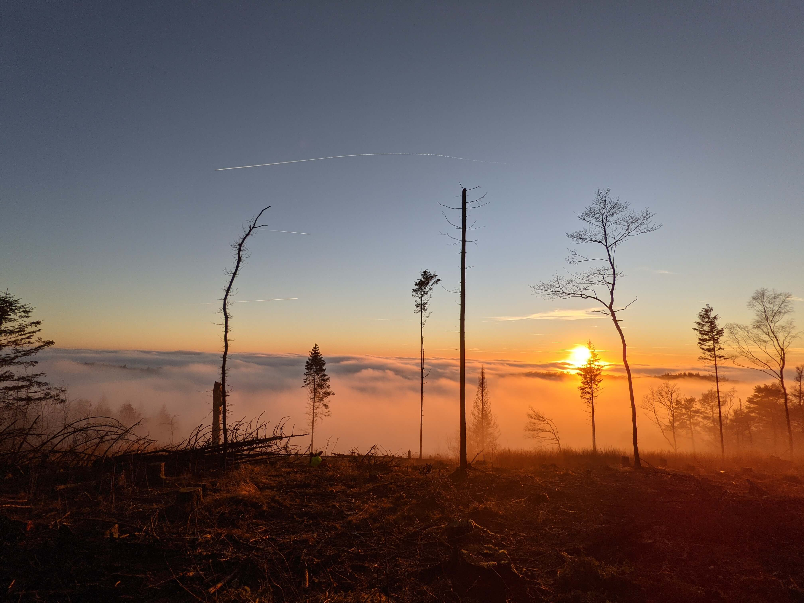
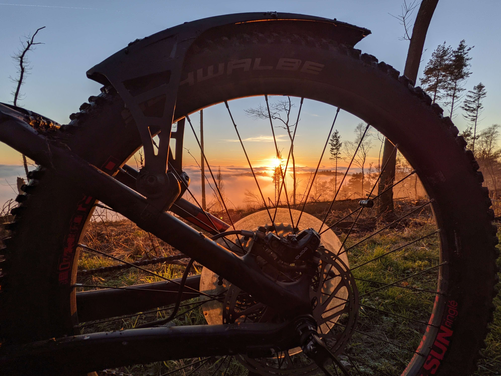
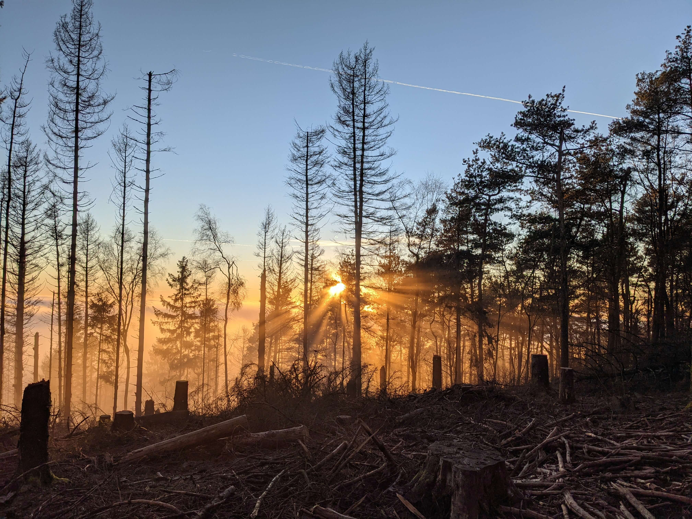
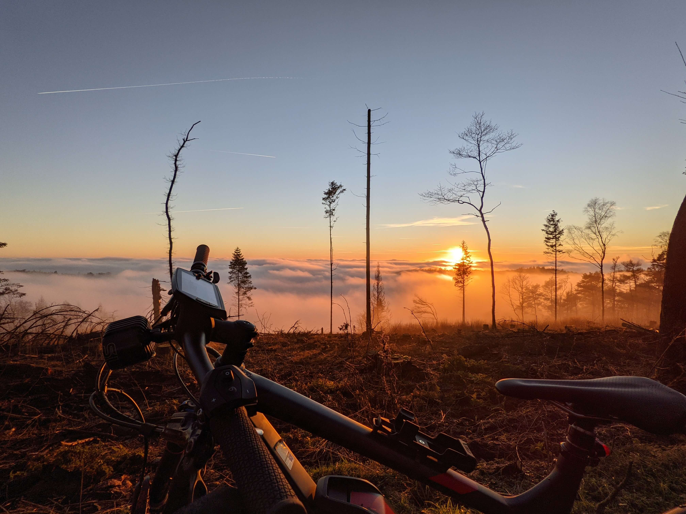

Am Abend zuvor wurde für den nächsten Tag sonniges, aber kaltes Wetter angesagt. Daraufhin habe ich mir vorgenommen, mit dem Bike zu fahren. Am nächsten Tag konnte ich dann leider keine Sonne sehen, da der Nebel diese verdeckt hatte. Fast hatte ich mit meinem kleinen Trip abgeschlossen, als dann um etwa 14 Uhr doch die Sonne zum Vorschein kam. Leider wird es aktuell sehr schnell dunkel, weshalb ich mich schnell mit meinem Auto, in welchem das Bike drin verstaut war, zur gewünschten Location begeben habe - einem Berg in meiner Heimatstadt.

Am Berg angenommen hat mich eine Mountainbikerin beim Ausladen angesprochen und bemerkt, dass ich aber spät dran bin. 'Leider ja, weil ich eben noch unsicher mit dem Wetter war' - entgegnete ich. Dann machte ich mich auf und fuhr den Berg weiter hoch. Leider war es dann doch etwas zu warm, wodurch die Wege sehr matschig waren und eben nicht vereist, so wie ich gehofft hatte. Aus diesem Grund ging es dann nur im gemäßigten Tempo weiter, bis ich dann nach und nach bemerkte, welche schöne Kulisse mich weiter oben auf dem Berg erwarten wird.

Es fühlte sich an, als wäre ich auf der Spitze eines 4000ers, welcher komplett in Wolken gehüllt ist. Das Tal, welches nur etwa 100 Meter Höhenunterschied zum Berg aufweist, war komplett im Nebel versunken. Zusätzlich war der Himmel wolkenlos und es fand ein Sonnenuntergang statt. Ein wunderschönes Naturschauspiel, welches auch von anderen Leuten bewundert und fotografiert wurde. Teilweise hat es sich auch angefühlt, als sei man in einem Flugzeug, aus welchem man gerade den Sonnenuntergang beobachten würde. Der komplett wolkenlose Himmel über uns hat und dann schnell in den Glauben versetzt, als wären wir tatsächlich auf einer Höhe, bei welcher die richtigen Wolken unter uns ihre Bahnen ziehen. Anbei ein paar Bilder von diesem kleinen Wunder.



<strong>Bilder</strong>

Naturschauspiel, geschuldet dem Temperaturunterschied zwischen Berg und Tal 

Blick durch stehendes Rad auf Naturschauspiel 

Die Überlebenden des Borkenkäfers verdecken mir die Sicht 

Gleiches Naturschauspiel, nur eben mit Bike 

  


