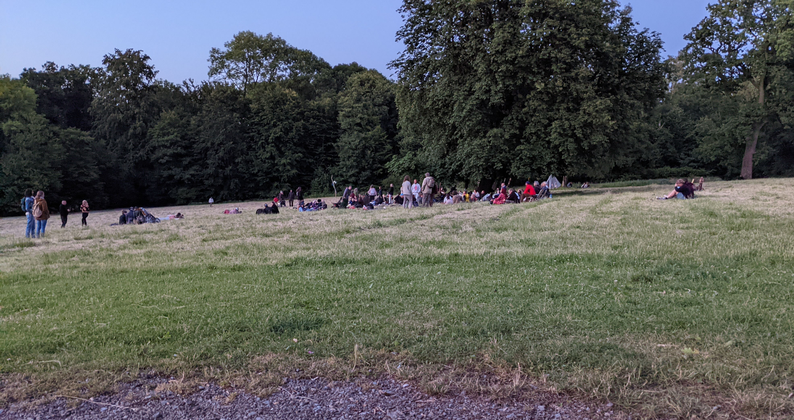
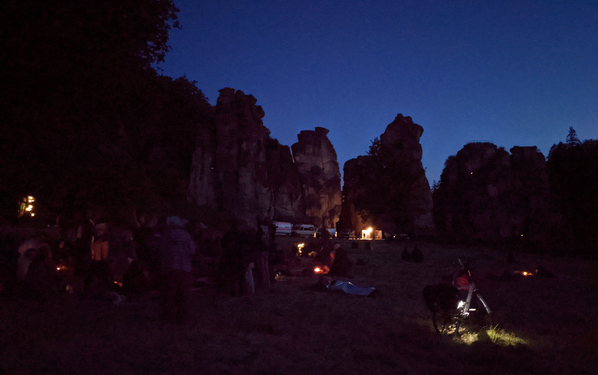

Although I am not really esoterically inclined, I spent time at the Externsteine near Detmold on the summer solstice. I was already familiar with the annual festival there, because a few years ago I had to do with a person who had a lot for esotericism. This person had shared many experiences at that time, which were also in connection with the Externsteine. Partly the told experiences seemed very crazy to me, which is why I approached the evening with an interesting expectation.

In my calendar I had not marked this day in red, which is why I would have missed the summer solstice, if the radio had not accidentally reported about the festival at the Externsteine. At that time I was anyway just with my car on the way and after few considerations I decided then to take the somewhat over 50 minutes journey on me. I had hesitated at first, because it was already almost 20 o'clock. But this event only happens once a year and I told myself that I would regret it if I went to sleep at home instead. In my head, all my crazy imaginations were running in parallel, based on the stories of the experiences I had heard from the said person. I simply had to go there.

The turn signal was set to turn right into the parking lot of the Externsteine. However, I was prevented from doing so because a roadblock and a security man were in my way. After I had stopped just before it, I rolled down my window and asked the security man why I was not allowed to enter the parking lot and where I could park my car instead. In the end, I parked my car a few streets away, because the closure was supposed to prevent the access of even more campers. Because many participants of the festival had probably already settled there a few days ago with their campers, although this was actually not allowed.

The street where I parked my car was connected with a small path through the forest with the parking lot of the Externsteine, which meant that I needed only a few minutes on foot to reach the original parking lot. In fact, there were already a few RVs or converted vans parked there. All of them were plain for the most part. Only a few were colorfully designed and were supposed to express closeness to nature. A little further away from me, at the edge of the parking lot, I could spot two fire trucks with about 10 people. I asked myself where I had landed here. Because an extra security with roadblock and now still the fire department heated up my imagination even more. Will I meet people later who will go completely crazy?

From the parking lot to the Externsteine it was also another 5-10 minutes walk. At the right edge of this footpath the next forces had already parked their vehicles - the police. Whole 5 cars stood there completely deserted. I was really curious what will expect me at the Externsteine. Along the way I already met the first participants, which could be easily recognized by the style of clothing. With my normal gait I overtook a man and a woman, which barefoot with loose clothing and a stick rather a more comfortable gait to the day.

Slowly I could see the Externsteine. I also recognized directly that the festivities take place around a big old tree, which grew on a big meadow in front of the Externsteine. Around this tree many people have already gathered and settled down with their drums and blankets. While I continued to follow the path to the Externsteine, I walked along this meadow and watched the celebrating people. In front of me, directly in front of the Externsteine, more vehicles parked. Consisting of two ambulances of the DRK and two normal sprinters, which were probably the security. Because also directly on site were several security people to be found, which ensured that not wildly camped or even climbed on the Externsteine.

Arrived at the Externsteine I was probably very anxious to act haphazardly on the surrounding people. Because I stood first only helplessly in the area around and perceived everything, in order to consider me then, what I do now next. During this phase I noticed how a woman had talked to the men from the security. Said people were standing in and in front of a tent that the security had erected to shelter in case of possible rain. This tent was held from top to bottom in black and the probably also esoterically inclined woman did not really like that. She told the men that a tent in white would be much nicer. The men showed respect and also took a piece of paper, which the woman was probably distributing. I was a little curious then, what this woman there for slips of paper distributed. Unfortunately, she then moved away in the opposite direction in which I had actually planned to go.

It led me along the path between the Externsteine, which I walked leisurely along and let my eyes wander. Of course, in the hope to see more interesting things at and around the Externsteine. This time I was overtaken by a person with a brisk walk. However, this person then unerringly turned off the path and walked to a flowering bush. Arrived at the bush he closed his eyes and smelled intensely the blooming flowers (is that already a pleonasm? After all, the flowers could be closed ...). He had no shoes on either and he probably didn't mind the many stones on the ground, because he then followed his path briskly again. I wondered where he was going, since the celebrating people were in the opposite direction under the tree. Therefore, I put on my hood, made a roll forward and followed this person inconspicuously. No, of course I didn't. I calmed my curiosity with the thought that there are probably also many revelers who might spend this day alone in the forest. 

I went back between the Externsteine and sat down on a bench, from which I could follow the celebrations of the summer solstice well. Since I didn't want to seem so helpless, I unpacked my notebook and placed it on the table in front of me. To be honest, I had imagined it differently. As good as all participants were around the tree. I had expected, however, that the persons made themselves much wider, whereby I could go times from A to B. But instead I was sitting on a bench in front of my notebook and didn't know what to do next. The participants were already busy drumming and singing, but the festivities would surely get more extreme and interesting, I thought to myself. After I had spent about 30 minutes at my notebook and I had the idea to write a blog entry about this evening, I packed my things, got up and went on the small tour around the Externsteine. Of course, again with the hope to discover more interesting things.

I left the Externsteine now behind me and I went further around the adjacent lake. Then I noticed a woman who sat all alone on a bench and looked in the direction of the Externsteine. I passed her and let my eyes wander. Thereby I noticed that this woman has similarity with the woman, who had distributed notes to the security before. I took a closer look and sure enough, there were several notes next to her on her bag. "Excuse me," I said in the direction of the woman. She turned around and I asked her if she was not the woman who had just handed out notes at the Externsteine. My hope was that I would also get one of these notes, because I expected it to be something esoteric. If I already show interest for this tradition, then also correctly. 

My question really awakened her. She took a piece of paper, stood up and held it out to me with motivation. I took the piece of paper and looked at it more exactly (attached also a photo of the piece of paper). There were several small pictures, all of which had been assigned a number. Right away, I didn't understand it and would much rather have it explained by the woman. I looked up and asked her what exactly it all meant. She then explained each drawing to me and explained what was behind the numbers. It then quickly became clear to me in which direction it was going. She spoke about the fact that money would soon be worth nothing and that we would soon all be equipped with microchips. She then substantiated these events with certain chapters from the Bible, which should be summarized under the title "God's plan of redemption - the revelation of John". Thereupon I asked 1-2 questions out of respect, but she had difficulties to understand them correctly. My questions were not really demanding and should only repeat what the woman had said. The lack of receptiveness seemed to me as if she was under the influence of drugs or had her head somewhere else for other reasons. Then our little round of questions was interrupted by an extremely small and ringing device. It turned out to be her cell phone and her boyfriend wanted to reach her. "Go ahead and answer it, I don't want to disturb" - I said and got back a "You're not disturbing!". Nevertheless, I said goodbye and continued my tour. 

It is important to say that I had the impression that it was an isolated case and that the majority present did not share these views. Especially since the ideas of the woman were also closely linked to the Bible, which is not always relevant for esotericists. In addition, the woman did not really participate in the festivities and was very introverted and alone. I also had the impression that she was somewhat depressed and sad. If you now link this with her ideas, you could think that she is very afraid of these things actually happening.

I was now very close to the Externsteine again and my tour was almost done. Shortly before the end I noticed a person at a shady and difficult to see place, who stood directly in front of the stones and did not move. My amateurish guess was that this person was trying to absorb energy from the stones. While I continued to approach my bench from before, I kept an eye on this person, but there was no movement. I did not want to sit on the bench again, so I decided to approach the center of the evening. It was planned to observe actually only from the distance something, in order not to disturb. However, other, not associated persons had already nourished the party and visibly enjoyed the good mood and the music.

The closer I came, the more spicy smells I could perceive, which were probably caused by incense. Later, a person should draw my attention to the fact that the people present partly also consume grass and the police of course should not notice this so. For this reason, then things like incense sticks are lit to cover the smell of grass something. Some participants were already lying under blankets or in sleeping bags to warm up a bit. Because slowly it became somewhat fresh also under the large and by the festivities magically working tree. However, the sleeping bags may only be used to warm themselves, since spending the night in them counts as wild camping and is prohibited. For the preservation of this prohibition was responsible this evening the security, which went diligently the entire area of the Externsteine with flashlights up and down to catch potential wild campers. By the way, one of the security men told me that last year the festivities had lasted until 4 am. I definitely wasn't planning on staying that long, though. 

10 p.m. my smartphone showed me. We had probably already passed dusk and it was already difficult for me to recognize the faces of the participants. To my amazement, a few people were already making their way back. I had expected that it would only really get going around midnight anyway. Because the summer solstice is actually on 21.06.2022 and currently we still have the 20.06.2022.

There I stood now and observed the happening. Slowly I perceived that the mood rose and the drums and the singing became louder. Loudly, "Heeeyaaa Heeeyaaa Hoooo" was shouted, while dancing to the rhythm of the drums around the center, consisting of tea lights and uh a pineapple. And yes, it was a pineapple and I'm afraid I can't answer the question of 'why'. The attentive and esoteric reader asks himself now however surely, why here then only tea lights are used and not as usual around a solstice fire is danced. This has the reason that the Externsteine are in the middle of a nature reserve, in which open fire is forbidden. Enclosed also times the one or other audio recording, in order to be able to make itself times a picture and/or sound of the tendency.

The topic drugs is naturally also a topic. I had already written that here by some participants also completely klischeehaft grass is consumed. In loose and colorful clothing, some with straw hats are bobbing along to the rhythms of the drums, while gleefully pulling on the joint. Whether other substances were consumed, I can not say. Only the alcohol was still quite obviously present. I was particularly struck by the alcohol consumption of a small group, which stood a little apart. Somehow they gave me the impression that they didn't really belong and that they were more of the punk type who only came to drink (greetings to Sylt!). However, one of the people then also started at some point with the drums, which then somehow belonged.

Tea lights were now clearly visible at the Externsteine due to the darkness. Apparently, someone had snuck past the security and placed them there. The backdrop and the rhythmic sounds would certainly have enticed me to join in the celebration, if I wasn't so queued up and so serious. So many people were having fun, dancing and drumming. My expectations were not completely fulfilled, because I expected to meet people who do not correspond to my world view and do quite crazy things. But the more beautiful I find it that I could spend the evening instead with quite normal persons, who behaved for the most part also quite normally and simply had fun. And of course there were exceptions, like the woman with her little notes or one or the other who didn't seem to be quite there anymore. But the majority was in a very cool mood and there was not a single incident that evening. All rules were followed and only tea lights were used consistently - at least as far as I could tell.

In the meantime it was after 23 o'clock and the lighting consisting of tea lights and light chains came by the darkness now particularly to the validity. To my right, I noticed two guys approaching the party. It was not clear to me whether they had just joined or had been there for a while. At least I didn't really notice them in the darkness. Actually a miracle, because one of the two had drunk probably extremely much alcohol and had to be supported by the other person again and again. At some point, however, this was no longer feasible and the heavily intoxicated man lay down in the grass and looked up at the sky. Then a woman walked past me and stopped at the two guys. She looked at the person lying in the grass, whereupon the man with the lower alcohol level said that she didn't have to worry about him, everything was fine. Then the woman looked up and replied quite dryly that she would be more worried about him, too, because he would not look so relaxed, unlike his friend who was heavily intoxicated and lying in the grass. And before she said that, she continued her walk, seemingly not even expecting a response. This came across as so unexpected and dry, it was just my sense of humor. 

Afterwards I stayed near the two, because they seemed to me as if they were only guests and not part of the drumming and singing crowd. In addition, quite funny dialogues took place between the two, which I then followed with one ear grinning again and again. At some point, however, the two came closer to me, as the alcohol made it difficult, especially for the one man, to stay on a firm spot. The more steadfast man then took this as an opportunity to address me. What exactly he said, I unfortunately do not remember. But I think that he tried to explain why his friend was currently in this condition. Quickly his friend put also an arm around me, in order to be able to hold itself better with the many revolutions upright.

The evening was supposed to go on for me until 2 o'clock and I spent it with the two drunken men. We talked a lot and I learned a lot about them. It was actually also only guests, which simply wanted to look at the summer solstice festival. Both are from Bochum and are just having a good time with the 9€ ticket. Especially the man with the lower level travels now since the beginning of the month across Germany and spends his night then in an open tent. Equipped only with the most necessary things, he explores the most beautiful places in Germany and then usually returns after a week to make himself fresh for a new tour at home. He also mentioned that he then shares his experiences on the Internet and that he already had a lot of followers. This statement made me wonder, because these words somehow did not fit the style of what had been said so far. At the latest when he then proudly spoke of a follower increase of around 2 million, which he should have received after his Sylt trip, it was clear to me that this is probably some joke or an insider. He also doesn't share his content on Instagram and the like, but on a platform that only people who call themselves "The Secrets" have access to. You can only become a member by invitation. Yeah, right. It's clear. Whether it was the alcohol or just a joke, I don't know. I only know that he told it very seriously and I just accepted what he said.

Coincidentally, both also had a special interest in computers. Both are members of Hackerspace Bochum, but were very modest about their knowledge. One only mentioned that he could boot and shut down a computer. However, I think that they had a good idea. Especially because both were a bit older. In the dark, I couldn't tell who was standing in front of me at the beginning and I estimated both of them to be around 20-26 years old. In the end, however, it turned out that the very unstable man is 30 years old and the other over 50 years. However, the 50-something man seemed extremely youthful and we could talk really well, as if we belonged to the same age group. While we listened to the festivities in the background, we had more long conversations about God and the world. Slowly I got tired and said goodbye to them. I went the way to the parking lot and the small forest way back, in order to arrive then at the car, with which I arrived then at approximately 3 o'clock at home.

Looking back it was a successful evening with many interesting impressions. Although I had other expectations, which were preloaded by the told stories and prejudices, but in the end it was all the better that most expectations did not come true. I did not spend the evening with completely crazy and crazy people. For the most part, they were normal people who just had fun drumming and singing and enjoyed the togetherness. Maybe one or the other had crazy thoughts, but these were never in the foreground. And sure, drugs were probably also part of the whole thing. However, I perceived it as if no hard drugs were involved, because otherwise the participants would have behaved differently. Only smoking and drinking took place - i.e. tobacco, weed and alcohol. However, it must be said that everyone present knew their limit, apart from the man who was then in my arms in the evening. Better to consume weed and contribute to a relaxed evening than to drink alcohol and end up mutating into a helpless individual.



<strong>Pictures</strong>

People have slowly gathered 

It was getting dark 

The note from the woman 

  

 



<strong>Audio recordings</strong>

 
<audio controls>
	<source src="audio1.mp4" type="audio/mpeg">
	Your browser does not support any of these audio formats
</audio>

<audio controls>
	<source src="audio2.m4a" type="audio/mpeg">
	Your browser does not support any of these audio formats
</audio>

  

