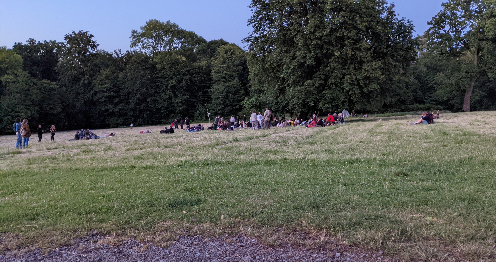
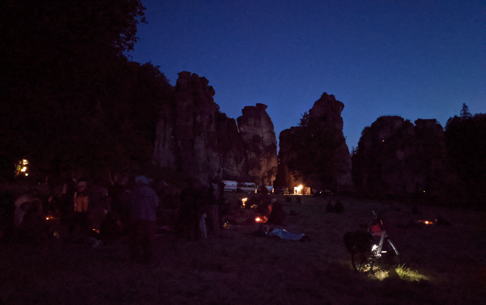
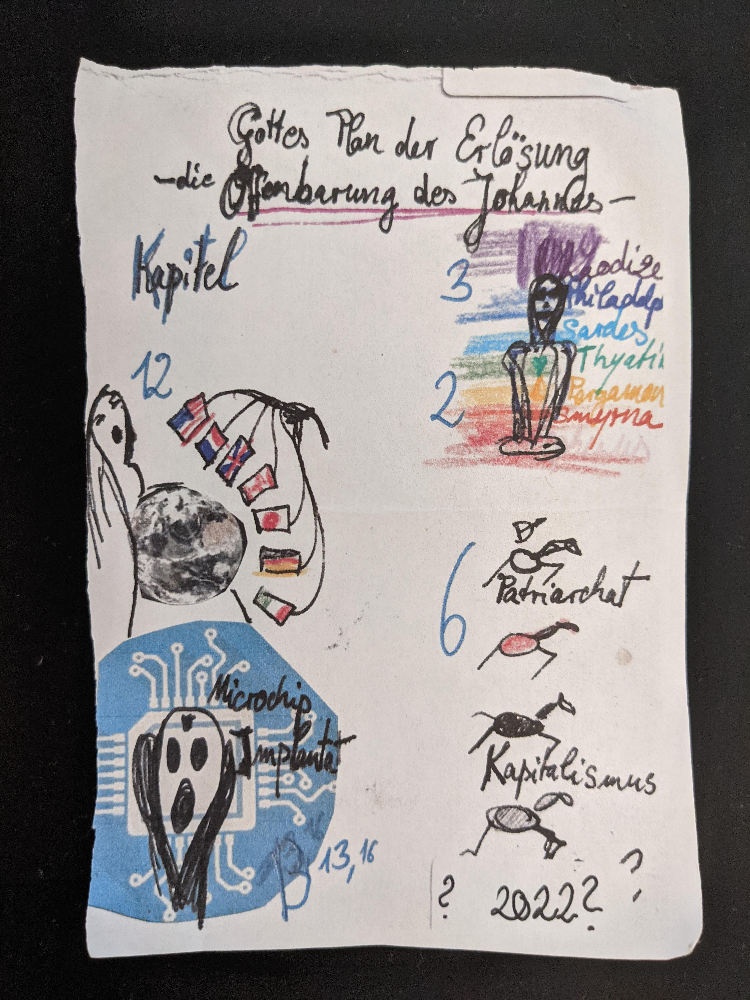

Obwohl ich selber nicht wirklich esoterisch veranlagt bin, habe ich mich an der Sommersonnenwende an den Externsteinen in der Nähe von Detmold aufgehalten. Mir war das dort jährlich stattfindende Fest bereits bekannt, da ich vor wenigen Jahren mit einer Person zu tun hatte, welche für die Esoterik viel übrig hatte. Viele Erlebnisse hatte diese Person damals geteilt, welche eben auch in Verbindung mit den Externsteinen standen. Teilweise wirkten die erzählten Erlebnisse sehr verrückt auf mich, weshalb ich den Abend auch mit einer interessanten Erwartungshaltung entgegenging.

In meinem Kalender hatte ich mir diesen Tag nicht rot markiert, weshalb ich die Sommersonnenwende wohl verpasst hätte, wenn das Radio nicht zufällig über das Fest an den Externsteinen berichtet hätte. Zu dem Zeitpunkt war ich sowieso gerade mit meinem Auto unterwegs und nach wenigen Überlegungen habe ich mich dann entschieden, die etwas über 50 Minuten Fahrtweg auf mich zu nehmen. Ich hatte erst gezögert, da es schon fast 20 Uhr war. Doch dieses Ereignis findet nur einmal im Jahr statt und ich sagte mir, dass ich es bereuen werde, wenn ich mich stattdessen zu Hause schlafen lege. In meinem Kopf liefen parallel dazu auch noch meine ganzen verrückten Vorstellungen ab, welche auf den Erzählungen der Erlebnisse basierten, welche ich von der besagten Person gehört hatte. Ich musste da einfach hin.

Der Blinker war gesetzt, um rechts auf den Parkplatz der Externsteine einzubiegen. Daran wurde ich jedoch gehindert, da mir eine Straßensperre und ein Securitymann im Weg standen. Nachdem ich knapp davor gehalten hatte, machte ich mein Fenster runter und fragte den Mann von der Security, wieso ich denn nicht auf den Parkplatz dürfte und wo ich stattdessen mein Auto abstellen könnte. Am Ende parkte ich mein Auto ein paar Straßen weiter, da durch die Sperrung die Zufahrt von noch mehr Campern verhindert werden sollte. Denn viele Teilnehmende des Festes hatten sich wohl schon vor wenigen Tagen dort mit ihren Wohnmobilen niedergelassen, obwohl dies eigentlich nicht erlaubt sei.

Die Straße, an der ich mein Auto parkte, war mit einem kleinen Weg durch den Wald mit dem Parkplatz der Externsteine verbunden, wodurch ich nur wenige Minuten zu Fuß benötigte, um den ursprünglichen Parkplatz zu erreichen. Tatsächlich parkten dort bereits einige Wohnmobile oder ausgebaute Transporter. Alle waren zum größten Teil schlicht gehalten. Nur wenige waren bunt gestaltet und sollten Naturverbundenheit ausdrücken. Ewas weiter von mir weg, am Rande des Parkplatzes, konnte ich zwei Feuerwehrwagen mit etwa 10 Personen entdecken. Ich fragte mich, wo ich hier nur gelandet bin. Denn eine extra Security mit Straßensperre und jetzt noch die Feuerwehr heizte meine Fantasie noch mehr auf. Werde ich nachher auf Menschen antreffen, die komplett durchdrehen werden?

Vom Parkplatz bis zu den Externsteinen waren es auch nochmal 5-10 Minuten Fußweg. Am rechten Rand dieses Fußweges hatten auch schon die nächsten Kräfte ihre Fahrzeuge abgestellt - die Polizei. Ganze 5 Wagen standen dort komplett verlassen. Ich war echt gespannt, was mich an den Externsteinen gleich erwarten wird. Dem Weg entlang begegnete ich auch bereits ersten Teilnehmern, welche man unschwer an den Stil der Kleidung erkennen konnte. Mit meinem normalen Gang überholte ich einen Mann und eine Frau, welche barfuß mit lockerer Kleidung und einem Stock eher einen gemütlicheren Gang an den Tag legten.

Langsam konnte ich die Externsteine sehen. Ich erkannte auch direkt, dass die Festlichkeiten um einen großen alten Baum herum stattfinden, welcher auf einer großen Wiese vor den Externsteinen gewachsen ist. Um diesen Baum herum haben sich bereits viele Menschen versammelt und sich mit ihren Trommeln und Decken niedergelassen. Während ich weiter den Weg zu den Externsteinen folgte, ging ich entlang dieser Wiese und beobachtete die feiernden Leute. Vor mir, direkt vor den Externsteinen, parkten weitere Fahrzeuge. Bestehend aus zwei Rettungswagen vom DRK und zwei normalen Sprintern, welche wohl der Security zugehörig waren. Denn auch direkt vor Ort waren mehrere Security Personen anzutreffen, welche dafür sorgten, dass nicht wild gecampt oder gar auf den Externsteinen geklettert wird.

Angekommen an den Externsteinen war ich wohl sehr bemüht planlos auf die umstehenden Personen zu wirken. Denn ich stand erst mal nur hilflos in der Gegend herum und nahm alles wahr, um mir dann zu überlegen, was ich nun als Nächstes mache. Während dieser Phase bemerkte ich, wie eine Frau mit den Männern von der Security geredet hatte. Besagte Personen standen in und vor einem Zelt, welches die Security aufgebaut hat, um sich bei möglichen Regen unterstellen zu können. Dieses Zelt war von oben bis unten in Schwarz gehalten und das gefiel der wohl auch esoterisch veranlagten Frau nicht wirklich. Sie teilte den Männern mit, dass ein Zelt in Weiß doch viel schöner wäre. Die Männer zeigten sich respektvoll und nahmen auch einen Zettel entgegen, welche die Frau wohl am Verteilen war. Etwas neugierig war ich dann schon, was diese Frau dort für Zettelchen verteilt. Leider entfernte sie sich dann in die entgegengesetzte Richtung, in welche ich eigentlich geplant hatte zu gehen.

Mich führte es den Weg zwischen den Externsteinen entlang, welchen ich gemütlich entlang ging und meine Blicken schweifen ließ. Natürlich in der Hoffnung, weitere interessante Dinge an und um den Externsteinen zu sehen. Diesmal wurde ich von einer Person mit einem zügigen Gang überholt. Diese Person bog dann aber zielsicher vom Weg ab und ging zu einem blühenden Busch. Angekommen am Busch schloss er seine Augen und roch intensiv an den blühenden Blüten (ist das schon ein Pleonasmus? Die Blüten könnten ja auch geschlossen sein ...). Auch er hatte keine Schuhe an und ihm machten die vielen Steine am Boden wohl nichts aus, da er dann auch wieder zügig seinem Weg folgte. Ich fragte mich, wohin er wohl geht, da die feiernden Leute sich in der entgegengesetzten Richtung unter dem Baum aufhielten. Deshalb setzte ich meine Kapuze auf, machte eine Rolle nach vorne und folgte dieser Person unauffällig. Nein, natürlich nicht. Ich besänftigte meine Neugier mit der Überlegung, dass es wohl auch viele Feiernde gibt, welche diesen Tag vielleicht für sich alleine im Wald verbringen. 

Ich ging wieder zwischen den Externsteinen hindurch zurück und setzte mich auf eine Bank, von welcher ich die Feierlichkeiten der Sommersonnenwende gut verfolgen konnte. Da ich nicht so hilflos wirken wollte, packte ich mein Notebook aus und stellte es vor mir auf den Tisch. Ehrlich gesagt hatte ich mir das anders vorgestellt. So gut wie alle Teilnehmer hielten sich um den Baum herum auf. Erwartet hatte ich jedoch, dass die Personen sich viel breiter machten, wodurch ich mal von A nach B gehen konnte. Stattdessen saß ich aber nun auf einer Bank vor meinem Notebook und wusste nicht, was ich als Nächstes machen sollte. Die Teilnehmer waren schon fleißig am Trommeln und am Singen, doch die Feierlichkeiten würden doch sicherlich noch extremer und interessanter werden, dachte ich mir. Nachdem ich etwa 30 Minuten an meinem Notebook verbracht hatte und ich auf die Idee kam über diesen Abend einen Blog Eintrag zu verfassen, packte ich meine Sachen, stand auf und begab mich auf den kleinen Rundgang um die Externsteine. Natürlich wieder mit der Hoffnung, weitere interessante Dinge zu entdecken.

Die Externsteine habe ich nun hinter mir gelassen und ich ging weiter um den anliegenden See herum. Dann ist mir eine Frau aufgefallen, welche ganz alleine auf einer Bank saß und in die Richtung der Externsteine schaute. Ich ging an ihr vorbei und lies meine Blicke schweifen. Dabei bemerkte ich, dass diese Frau Ähnlichkeit mit der Frau hat, welche zuvor Zettel an die Security verteilt hatte. Ich schaute genauer hin und tatsächlich: Neben ihr auf ihrer Tasche lagen mehrere Zettel. "Entschuldigung", sagte ich in Richtung der Frau. Sie drehte sich um und ich fragte sie, ob sie nicht die Frau wäre, welche eben an den Externsteinen Zettel verteilt hätte. Meine Hoffnung war, dass ich auch eines dieser Zettel bekomme, da ich erwartet hatte, dass es irgendwas Esoterisches ist. Wenn ich schon für diese Tradition Interesse zeige, dann auch richtig. 

Meine Frage hat sie regelrecht erwachen lassen. Sie nahm einen Zettel, stand auf und hielt ihn mir motiviert hin. Ich nahm den Zettel entgegen und schaute mir diesen genauer an (anbei auch ein Foto des Zettels). Zu sehen waren mehrere kleine Bilder, welche wohl alle eine Nummer zugewiesen bekommen haben. Auf Anhieb habe ich es nicht verstanden und wollte es auch viel lieber von der Frau erklärt haben. Ich schaute auf und fragte sie, was genau das denn alles bedeuten würde. Daraufhin erklärte sie mir jede Zeichnung und erläuterte, was sich hinter den Zahlen verbarg. Es wurde mir dann schnell klar, in welche Richtung es ging. Sie sprach davon, dass das Geld bald nichts mehr wert sei und dass wir bald alle mit Mikrochips ausgestattet werden. Diese Ereignisse belegte sie dann mit bestimmten Kapiteln aus der Bibel, welche zusammenfassend unter dem Titel "Gottes Plan der Erlösung - die Offenbarung des Johannes" stehen sollen. Daraufhin stellte ich aus Respekt 1-2 Rückfragen, bei welchen sie aber Schwierigkeiten hatte, diese richtig zu verstehen. Dabei waren meine Rückfragen nicht wirklich anspruchsvoll und sollten nur das Gesagte der Frau wiederholen. Die mangelnde Aufnahmefähigkeit wirkte für mich so, als wäre sie unter Drogeneinfluss oder hätte ihren Kopf aus anderen Gründen ganz woanders. Dann wurde unsere kleine Fragerunde durch ein extrem kleines und klingelndes Gerät unterbrochen. Es stellte sich heraus, dass es ihr Mobiltelefon war und ihr Freund sie erreichen möchte. "Gehen sie ruhig ran, ich möchte nicht stören" - sagte ich und bekam ein "Sie stören nicht!" zurück. Dennoch verabschiedete ich mich und setzte meinen Rundgang fort. 

Wichtig zu sagen ist, dass ich den Eindruck hatte, dass es sich um einen Einzelfall gehandelt hat und die anwesende Mehrheit nicht diese Ansichten teilt. Zumal die Vorstellungen der Frau ja auch eng mit der Bibel verknüpft waren, welche für Esoteriker nicht immer von Relevanz ist. Zudem nahm die Frau auch nicht wirklich an den Feierlichkeiten teil und war sehr in sich gekehrt und für sich alleine. Ich hatte außerdem den Eindruck, dass sie etwas niedergeschlagen und traurig war. Wenn man das nun mit ihren Vorstellungen verknüpft, könnte man meinen, dass sie große Angst davor hat, dass diese Dinge tatsächlich eintreffen.

Den Externsteinen war ich nun wieder ganz nah und mein Rundgang war fast erledigt. Kurz vor Ende nahm ich dann noch eine Person an einer schattigen und schwierig einsehbaren Stelle wahr, welche unmittelbar vor den Steinen stand und sich nicht bewegte. Meine laienhafte Vermutung war, dass diese Person wohl gerade Energie aus den Steinen versuchte aufzunehmen. Während ich mich weiter meiner Bank von zuvor näherte, behielt ich diese Person im Auge, doch es fand keine Bewegung statt. Auf die Bank wollte ich mich nun nicht nochmal setzten, weshalb ich beschlossen habe, mich dem Mittelpunkt des Abends etwas zu nähern. Geplant war es eigentlich nur aus der Ferne etwas zu beobachten, um nicht zu stören. Allerdings hatten sich auch bereits andere, nicht zugehörige Personen dem Fest genährt und sichtlich die gute Stimmung und die Musik genossen.

Je näher ich kam, desto mehr würzige Gerüche konnte ich wahrnehmen, welche vermutlich durch Räucherstäbchen verursacht wurden. Später sollte mich eine Person darauf aufmerksam machen, dass die anwesenden Personen teilweise auch Gras konsumieren und die Polizei das natürlich nicht so mitbekommen soll. Aus diesem Grund werden dann Dinge wie Räucherstäbchen angezündet, um den Grasgeruch etwas zu überdecken. Manche Teilnehmer lagen auch bereits unter Decken oder in Schlafsäcken, um sich etwas zu wärmen. Denn langsam wurde es auch unter dem großen und durch die Feierlichkeiten magisch wirkenden Baum etwas frisch. Allerdings darf sich mit den Schlafsäcken nur gewärmt werden, da das Übernachten in diesen als Wildcampen zählt und verboten ist. Für die Wahrung dieses Verbots war an diesem Abend die Security zuständig, welche fleißig das gesamte Gebiet der Externsteine mit Taschenlampen auf und ab gingen, um potenzielle Wildcamper zu erwischen. Übrigens teilte mir einer der Security Männer mit, dass die Feierlichkeiten im letzten Jahr bis 4 Uhr morgens angehalten haben. So lange hatte ich aber definitiv nicht vor zu bleiben. 

22 Uhr zeigte mir mein Smartphone an. Die Dämmerung hatten wir wohl schon hinter uns und es fiel mir bereits schwer, die Gesichter der Teilnehmer zu erkennen. Zu meiner Verwunderung begaben sich bereits ein paar Personen auf den Rückweg. Erwartet hatte ich, dass es sowieso erst um Mitternacht herum richtig abgeht. Denn die Sommersonnenwende ist eigentlich am 21.06.2022 und aktuell haben wir ja noch den 20.06.2022.

Da stand ich nun und beobachtete das Geschehen. Langsam nahm ich wahr, dass die Stimmung stieg und die Trommeln sowie der Gesang lauter wurden. Laut wurde "Heeeyaaa Heeeyaaa Hoooo" gerufen, während man passend zum Rhythmus der Trommeln um den Mittelpunkt, bestehend aus Teelichtern und äh einer Ananas, tanzte. Und ja, es war eine Ananas und ich kann die Frage nach dem 'Warum' leider nicht beantworten. Der aufmerksame und esoterische Leser fragt sich nun aber sicherlich, warum hier denn nur Teelichter verwendet werden und nicht wie üblich um ein Sonnwendfeuer getanzt wird. Dies hat den Grund, dass sich die Externsteine mitten in einem Naturschutzgebiet befinden, in welchem offenes Feuer verboten ist. Anbei auch mal die ein oder andere Audioaufnahme, um sich mal ein Bild bzw. Ton von der Stimmung machen zu können.

Das Thema Drogen ist natürlich auch ein Thema. Ich hatte ja bereits geschrieben, dass hier von manchen Teilnehmern auch ganz klischeehaft Gras konsumiert wird. In lockerer und bunter Kleidung wird dann teils mit Strohhut zu den Rhythmen der Trommeln mitgewippt, während genüsslich am Joint gezogen wird. Ob noch andere Substanzen konsumiert wurden, kann ich nicht sagen. Lediglich der Alkohol war noch ganz offensichtlich präsent. Besonders aufgefallen war mir der Alkoholkonsum einer kleinen Gruppe, welche etwas abseits gestanden hat. Irgendwie haben die auf mich den Eindruck gemacht, nicht richtig dazuzugehören und eher aus der Punk Richtung zu kommen, welche nur zum Saufen angereist sind (Grüße nach Sylt!). Allerdings fing einer der Personen dann auch irgendwann mit dem Trommeln an, wodurch die dann doch irgendwie dazugehörten. 

Teelichter waren aufgrund der Dunkelheit nun auch klar an den Externsteinen erkennbar. Scheinbar hatte sich jemand an der Security vorbeigeschlichen und diese dort platziert. Die Kulisse und die rhythmischen Klänge hätten mich sicherlich dazu verleitet mitzufeiern, wenn ich mich nicht so anstellen würde und so ernst wäre. So viele Personen hatten Spaß, haben getanzt und getrommelt. Meine Erwartungen wurden nicht ganz erfüllt, da ich erwartet hatte, auf Menschen zu treffen, welche nicht meinem Weltbild entsprechen und ganz verrückte Dinge tun. Aber umso schöner finde ich es, dass ich den Abend stattdessen mit ganz normalen Personen verbringen konnte, welche sich größtenteils auch ganz normal verhalten haben und einfach nur Spaß hatten. Und natürlich gab es auch Ausnahmen, wie etwa die Frau mit ihren Zettelchen oder den ein oder anderen, der nicht mehr ganz anwesend wirkte. Die Mehrheit war jedoch sehr cool drauf und es gab an dem Abend auch keinen einzigen Zwischenfall. Alle Vorschriften wurden eingehalten und es wurden auch konsequent nur Teelichter verwendet - zumindest soweit ich das mitbekommen habe.

Inzwischen war es nach 23 Uhr und die Beleuchtung bestehend aus Teelichtern und Lichterketten kamen durch die Dunkelheit nun besonders zur Geltung. Rechts von mir bemerkte ich, wie sich zwei Typen der Feier näherten. Es war für mich nicht klar, ob diese gerade erst dazugekommen sind oder schon länger dabei waren. Zumindest sind mir die beiden in der Dunkelheit nicht wirklich aufgefallen. Eigentlich ein Wunder, denn der eine der beiden hatte wohl extrem viel Alkohol getrunken und musste von der anderen Person immer wieder gestützt werden. Irgendwann war das dann aber nicht mehr machbar und der stark alkoholisierte Mann legte sich ins Gras und schaute in den Himmel. Daraufhin ging eine Frau an mir vorbei und hielt bei den beiden Typen inne. Sie schaute die im Gras liegende Person an, woraufhin der Mann mit dem niedrigeren Alkoholpegel sagte, dass sie sich keine Sorgen um ihn machen muss, es sei alles in Ordnung. Dann schaute die Frau hoch und antwortete ganz trocken, dass sie sich auch eher Sorgen um ihn machen würde, da er im Gegensatz zu seinem stark alkoholisierten und im Gras liegenden Freund nicht so entspannt aussehen würde. Und ehe sie das gesagt hat, setzte sie ihren Gang fort und erwartete scheinbar nicht mal eine Antwort. Das kam so unerwartet und trocken rüber, dass es genau mein Humor war. 

Danach hielt ich mich weiter in der Nähe der beiden auf, da diese auf mich so wirkten, als wären sie auch nur zu Gast und nicht Teil der trommelnden und singenden Menge. Außerdem fanden zwischen den beiden ganz lustige Dialoge statt, welche ich dann mit einem Ohr immer wieder grinsend verfolgt habe. Irgendwann kamen die beiden mir dann aber näher, da der Alkohol es besonders dem einen Mann schwer machte, auf einer festen Stelle zu verweilen. Dies nahm der standhaftere Mann dann zum Anlass, mich anzusprechen. Was genau er sagte, weiß ich leider nicht mehr. Ich meine aber, dass er sich zu erklären versuchte, warum sein Freund sich aktuell in diesem Zustand befindet. Schnell legte sein Freund auch einen Arm um mich, um sich bei den vielen Umdrehungen besser aufrecht halten zu können.

Den Abend sollte für mich noch bis 2 Uhr gehen und ich habe diesen mit den beiden angetrunkenen Männern verbracht. Wir haben viel geredet und ich habe viel über die beiden erfahren. Es waren tatsächlich auch nur Gäste, welche sich das Sommersonnenwendefest einfach nur anschauen wollten. Beide stammen aus Bochum und lassen es sich gerade mit dem 9€-Ticket gut gehen. Besonders der Mann mit dem niedrigeren Pegel reist nun schon seit Beginn des Monats quer durch Deutschland und verbringt seine Nacht dann in einem offenen Zelt. Nur ausgerüstet mit den nötigsten Sachen erkundet er die schönsten Orte in Deutschland und kehrt dann meistens nach einer Woche wieder zurück, um sich zu Hause wieder frisch für eine neue Tour zu machen. Er erwähnte auch, dass er seine Erlebnisse dann im Internet teilt und er schon sehr viele Follower hätte. Diese Aussage machte mich stutzig, da diese Worte vom Stil her irgendwie nicht zu dem bisherigen Gesagten passten. Spätestens als er dann stolz von einem Followerzuwachs von um die 2 Millionen sprach, welche er nach seinem Sylt-Trip erhalten haben soll, war mir klar, dass das vermutlich irgendein Witz oder ein Insider sein soll. Auch teilt er seine Inhalte nicht bei Instagram und Co, sondern auf einer Plattform, zu der nur Personen Zugang haben, die sich "Die Secrets" nennen. Mitglied wird man nur auf Einladung. Ja, ne. Ist klar. Ob es jetzt der Alkohol war oder doch nur ein Witz, ich weiß es nicht. Ich weiß nur, dass er es sehr ernst erzählt hat und ich das Gesagte einfach nur hingenommen habe.

Zufälligerweise hatten beide auch ein besonderes Interesse an Computern. Beide sind Mitglied im Hackerspace Bochum, doch haben sich sehr bescheiden mit ihrem Wissen zurückgehalten. Der eine erwähnte nur, dass er einen Computer hoch- und herunterfahren kann. Allerdings denke ich, dass die ordentlich Ahnung gehabt haben. Besonders weil beide auch schon etwas älter waren. Im Dunkeln konnte ich am Anfang nicht erkennen, wer genau jetzt vor mir steht und ich habe beide so auf um die 20-26 Jahre geschätzt. Am Ende stellte sich aber heraus, dass der sehr instabile Mann 30 Jahre alt ist und der andere über 50 Jahre. Der über 50-Jährige Mann wirkte aber extrem jugendlich und man konnte richtig gut reden, so als wäre man derselben Altersklasse angehörig. Während wir den Festlichkeiten im Hintergrund gelauscht haben, haben wir noch weitere lange Gespräche über Gott und die Welt geführt. Langsam wurde ich dann müde und verabschiedete mich von den beiden. Ich ging den Weg zum Parkplatz und den kleinen Waldweg zurück, um dann am Auto Anzugelangen, mit welchem ich dann um etwa 3 Uhr zu Hause angekommen bin.

Rückblickend war es ein gelungener Abend mit vielen interessanten Eindrücken. Zwar hatte ich andere Erwartungen, welche durch die erzählten Geschichten und Vorurteile vorbelastet waren, doch am Ende war es umso besser, dass die meisten Erwartungen nicht eingetroffen sind. Den Abend habe ich nämlich nicht mit völlig verrückten und durchdrehenden Leuten verbracht. Es waren zum größten Teil ganz normale Menschen, welche einfach nur Spaß am Trommeln und Singen hatten und die Gemeinsamkeit genossen haben. Vielleicht hatte der ein oder andere ganz verrückte Gedanken, doch diese standen zu keiner Zeit im Vordergrund. Und klar, Drogen waren wohl auch Teil des Ganzen. Allerdings nahm ich es so wahr, als wären keine harten Drogen im Spiel gewesen, da sich die Teilnehmer sonst anders verhalten hätten. Lediglich geraucht und getrunken wurde - also Tabak, Gras und Alkohol. Allerdings muss man sagen, dass alle Anwesenden ihr Limit kannten, abgesehen von dem Mann, der mir dann am Abend in den Armen lag. Lieber Gras konsumieren und zu einem entspannten Abend beitragen, als Alkohol zu trinken und am Ende zu einem hilflosen Individuum zu mutieren.



<strong>Bilder</strong>

Die Menschen haben sich langsam gesammelt 

Es wurde langsam dunkel 

Der Zettel von der Frau 

  

 



<strong>Audioaufnahmen</strong>

 
<audio controls>
	<source src="audio1.mp4" type="audio/mpeg">
	Ihr Browser unterstützt keine dieser Audioformate
</audio>

<audio controls>
	<source src="audio2.m4a" type="audio/mpeg">
	Ihr Browser unterstützt keine dieser Audioformate
</audio>

  

