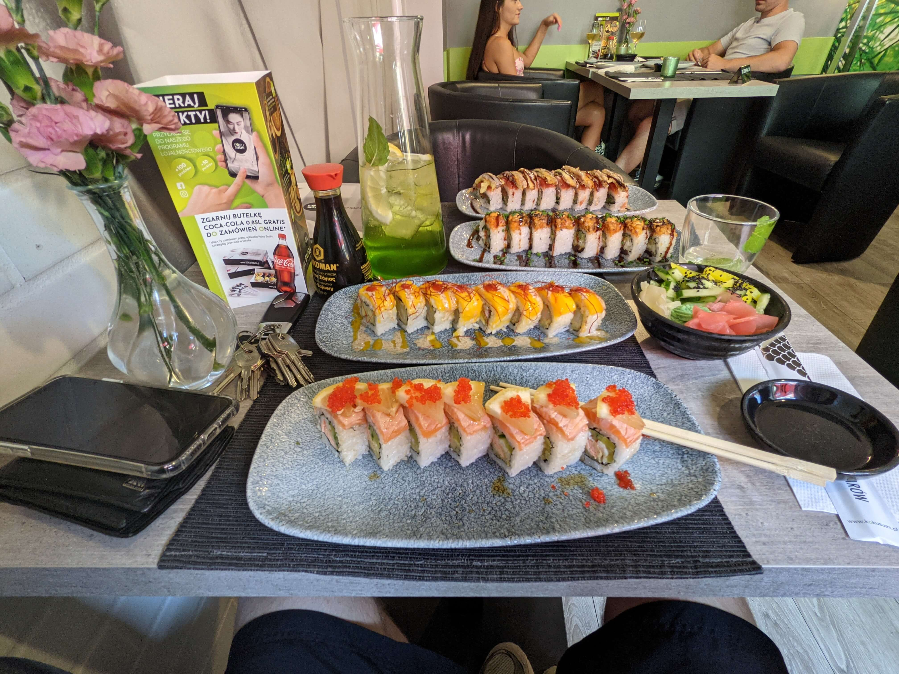
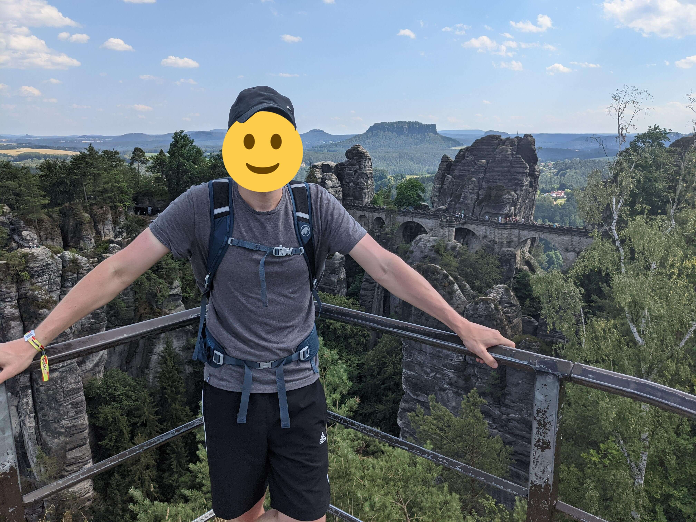
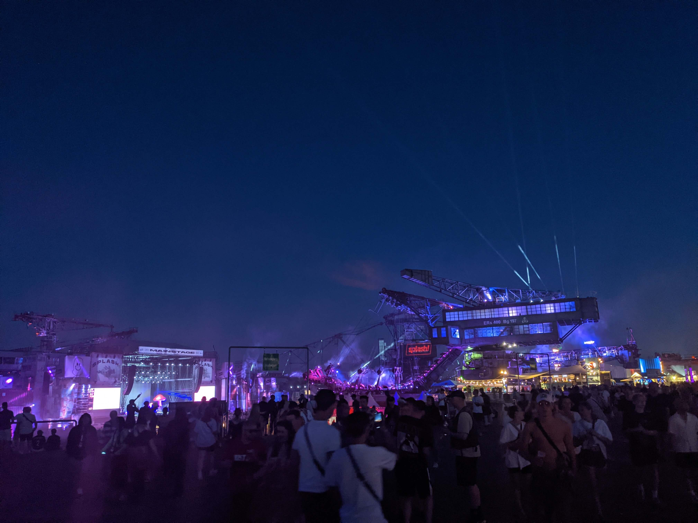

---
📆 18.07.2022 | 📌 Panorama Tower / Leipzig



Beitrag öffnen


Nach dem Besuch im Leipziger Zoo musste ich einfach noch das Panorama Tower Restaurant besuchen. Bei diesem Ausblick sein Essen zu genießen war echt ein schönes Erlebnis. Alleine unter älteren Menschen mit edlen Klamotten und ich in meiner Adidas Shorts. War halt warm und ein edler Anzug ist noch kein Teil meiner Garderobe.




---
📆 04.07.2022 | 📌 Sushi Restaurant / Polen



Beitrag öffnen


Den Wechselkurs gut ausgenutzt und Premium Sushi bestellt, welches mir in Deutschland viel zu teuer gewesen wäre. Dieses Sushi war perfekt und reiht sich direkt hinter meinem Favoriten, dem Sushi von Henssler&Henssler, ein.




---
📆 03.07.2022 | 📌 Bastei / sächsische Schweiz



Beitrag öffnen


Na gut. Habe ich nun auch mein typisches Foto mit der Bastei. Eine Ukrainerin war auch alleine dort und fragte, ob ich ein Foto von ihr machen könnte. Sie erwiderte meinen Gefallen und machte auch von mir ein Foto. Дуже дякую.




---
📆 02.07.2022 | 📌 Splash Festival / Gräfenhainichen



Beitrag öffnen


Das erste Mal auf einem Festival. Coole Kulisse und teils gute Auftritte. War definitiv eine Erfahrung wert. Als ich gefragt wurde, ob ich etwas zum "ziehen" brauche, dachte ich an Gras und lehnte ab. Wurde erst danach aufgeklärt, dass Koks gemeint war. 




---