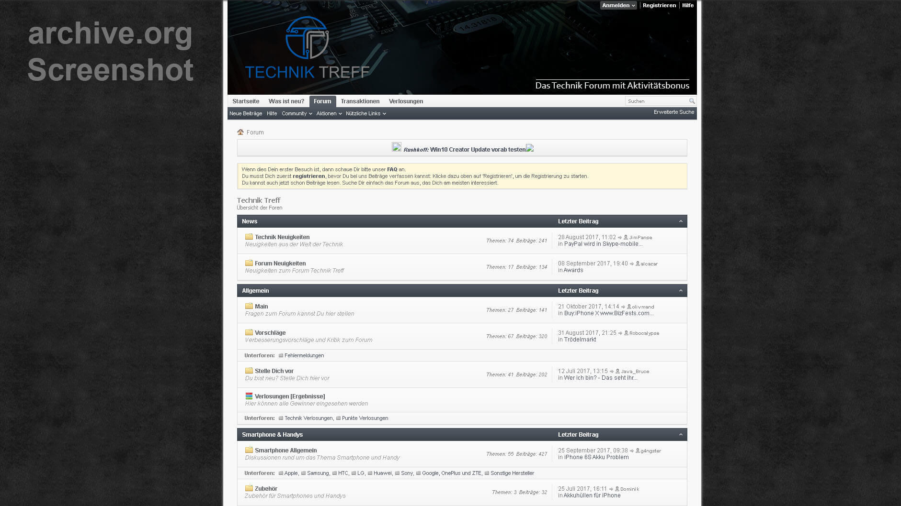
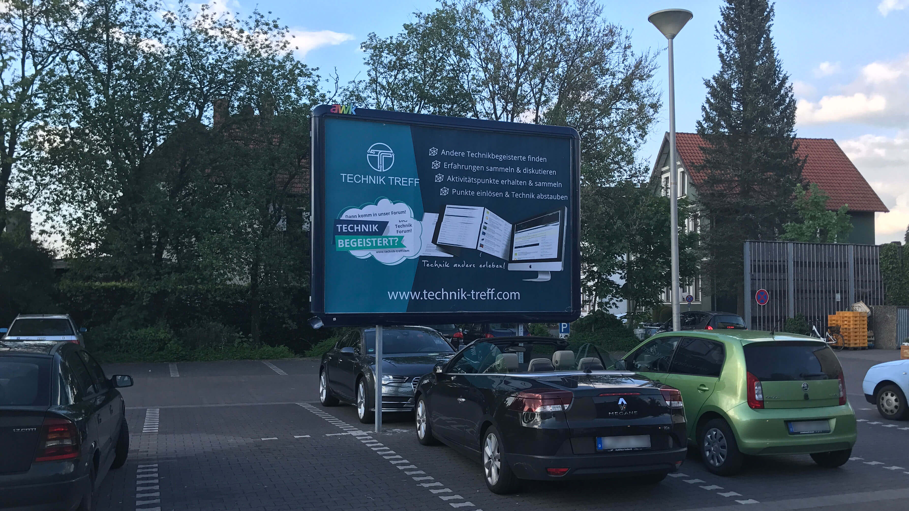
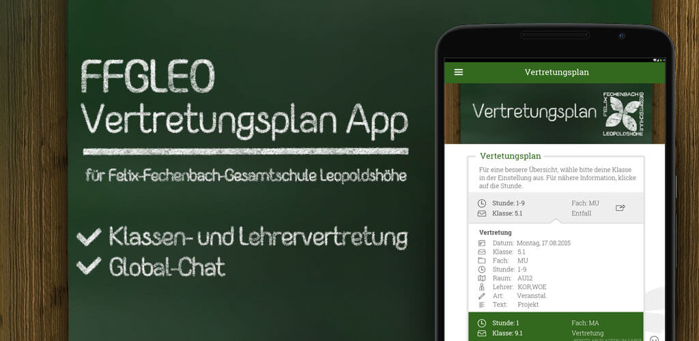

<!-- raw html -->

- ## Active

  - ### App

  **2020 -> ∞** - This project is currently getting the most attention. It's a mobile app that will run on iOS and Android. I already had the idea for it at the end of 2019, but at that time I didn't have the focus and time to start with it. That's why I didn't start researching and planning it until the summer of 2020. It will not be a small app, which is why I am also collaborating with other people on it. Then, in the second quarter of 2022, the app is expected to be released. Before that, I can't announce what kind of app it will be. As soon as there are news about it, they can be found here.

  > **Links:** ... coming soon.

  - ### Tauschglück

  **2020 -> ∞** - Tauschglück is a non-profit project that aims to reach a large donation sum in the end, which will then be donated to three different organizations. This money is to be achieved by swapping up objects. I have always been fascinated by how people have swapped up from a pin to a car or even a house. With Tauschglück, I'm now going the same way, only for a good cause.

  > **Links:**: [Website](https://tauschglueck.de/) | [Twitter](https://twitter.com/tauschglueck) | [Instagram](https://www.instagram.com/tauschglueck/)

  - ### WOT Band

  **2020 -> ∞** - A friend from school plays in a band and a few years ago the band wanted a website. Since I helped out the band from time to time anyway, I quickly agreed to create a website. With the help of Wordpress we quickly created a clear and functional site, which was hosted by Strato at that time. Due to some disagreements with Strato I migrated the website to my own server. Currently, the website is unfortunately only provided with regular updates, since no (or only limited) new gigs or events can take place through Corona, which then unfortunately eliminates new possible content for the website.

  > **Links:** [Website](https://wot-band.com/) | [YouTube](https://www.youtube.com/channel/UCmrEEkjT7P7FdJNCZnCw5dg) | [Instagram](https://www.instagram.com/wot_band/) | [Facebook](https://www.facebook.com/WOT-108065347223160)

- ## Inactive

  - ### Technik Treff

  **2017 -> 2018** - From 2017-2018 I ran a technology forum (vBulletin v4). Since I've been interested in technology for a long time, at some point I had the idea to build a small or even larger community with which you could have talked about all technology topics. Although in 2017 the death of normal forums was already sealed, the forum gained a membership of over 200 users in a few weeks. Users received points through posts and topics, with which they could participate in monthly raffles. The prizes were technology, such as brand new gaming headphones. In addition, the forum was filled with articles about current technology news, which were written by guest editors. I had invested a lot to fill the forum and to exchange information with users who were also interested in technology. I even had posters printed, hoping that I could attract new users with them. Many investments later, however, it became clear to me that I would have to give up the project, since forums really hardly have any chances anymore due to Reddit and Co.

  > **Links:** [Wayback Machine](https://web.archive.org/web/20180120061919/https://www.technik-treff.com/)

  

<strong>Pictures</strong>
 



- ### Teamspeak with Activity Bonus

  **2016 -> 2017** - I have been running a Teamspeak server under the subdomain ts.xelayz.com for ages. In the summer of 2016, I decided to fill this server with more users to build a community. My idea was to reward users for their activity. Since I was also already knowledgeable about cryptocurrencies, I decided to reward users with Bitcoin. My server monitored each user by their Teamspeak client ID and recorded their activity. Users were also automatically moved to a channel by a bot if they were inactive, at which point no more activity was recorded. The server then allocated an amount of Bitcoins to the users per minute. As soon as a certain amount of Bitcoins was reached, they were automatically sent to the Bitcoin address that the user had previously added to his Teamspeak description. The project ran well, but swallowed up too much money in the end and it was not foreseeable when the project could refinance itself through e.g. advertising. For this reason I stopped the project.

  > **Links:** [Wayback Machine](http://web.archive.org/web/20160602000849/https://xelayz.com/) | [Teamspeak Server](ts3server://ts.xelayz.com?port=9987)

  

<strong>Pictures</strong>



- ### Teachers Substitutions App

  **2015 -> 2016** - At my former school, where I started my Abitur, we were always shown the substitutions on a screen every morning. At some point, students found out that the screens only showed one website, which was publicly accessible. This then allowed us to track substitutions and cancellations on the go. Unfortunately, because there were so many classes and so many entries, the website always changed pages automatically. Then I had the idea that we could grab the entries from the website and display them in a more user-friendly way in an app. This project was quickly planned and implemented. Students could then select their class in the settings to have only relevant entries displayed. As soon as there was a new entry for the stored class, a push notification was immediately sent to the respective end device. The global chat also offered the possibility of exchanging information with other people. Logging in to the chat was done via the school's login data, which was sent to the school server for matching in order to verify the user. Unfortunately, after a few months, the app was then no longer officially allowed to continue, even though the school administration had thought it was a great idea. I was told that my school at the time was under the control of the Ministry of Education and that students were not officially allowed to use the app.

  > **Links:** [Apkpure](https://apkpure.com/ffgleo-vertretungsplan/com.ffgleo.vp)

  

<strong>Pictures</strong>
 



- ### Instagram Marketing

  **2015 -> 2019** - Self-presentation has been taking place on Instagram and the like for many years now, and a whole new market developed out of it, which I found very interesting around 2015. I have never seriously presented myself on Instagram, it was just never my thing. However, I was very interested in building up my own reach for a profile and then marketing this reach if I was successful. At first, I had to think about which topics would be best on Instagram and which name would be suitable for my project. I then decided on the topics of hotels, travel, technology and cars. With the nickname prefix "unreal\_" I wanted to make the affiliation of these 4 pages clear and to give this project a little more strength. Many hours I then invested regularly to pick out the most beautiful pictures and put them in an Instagram Sheduler, so that these posts are then automatically published at the best times. The first advertising requests came after a short time, which I had rejected for the time being, because these early promotions would have harmed my growth at the time. On the technology profile it came then with a larger technology manufacturer to the first cooperation. After this cooperation, I had accepted very few more, because the four Instagram profiles took up more and more time, which I then at some point no longer had. I neglected the project, which is why the Instagram profiles have been completely inactive since 2019. The largest profile, @unreal_hotels, changed hands in 2019, which however had not continued the 'hotels' topic. Shortly before the end of the Instagram profiles, I had still started to operate a platform on which I myself, but also other customers, could manage their Instagram profiles. The focus of this platform was on automating many Instagram processes to best increase the reach of the profiles. At the end of 2019, however, this platform was also discontinued, as Instagram had made it very difficult for such platforms to automate. In the end, it was just a game of cat and mouse, which became too much for me.

  > **Links:** [@unreal_worlwide](https://www.instagram.com/unreal_worldwide/) | [@unreal_performance](https://www.instagram.com/unreal_performance/) | [@unreal_tech](https://www.instagram.com/unreal_tech/)

- ### Tearless

  **2014 -> 2015** - In 2014, I was still very young and at that time I was attending secondary school in my town. At that time, I became aware of a person who had behaved differently from the others in real life. At some point, I found this person on the Internet under a nickname, which was similar on many platforms. On one platform I saw that this person posts and reposted difficult and critical content. Content that is usually posted by people who are in a very bad mental state. I wanted to help this person, but had never dared to approach this person about it. However, I continued to have the urge to help such persons, because it somehow affected me. Instead, I had set my mind to create a forum in which such persons could anonymously publish their problems in order to receive help from other users. Unfortunately my income was very low at that time, only 60€ per month by delivering newspapers. That's why I tried an older 'free' version of vBulletin, which quickly failed, because I couldn't handle the complexity of vB at that time. I switched to WoltLab for this reason and actually bought a legal license as well. The design issue bothered me a lot though, so I had to hire someone to finish a design for my forum. This cost me between about 250-400€ at the time, which was my entire savings at the time. In hindsight, it wasn't worth the money at all, but I was still very ignorant at the time and was glad that someone could help me. However, due to a change to the upper school at another school, the project unfortunately came to nothing due to time constraints and changes in my living conditions.

  > **Links:** [Wayback Machine](http://web.archive.org/web/2016*/tearless.net)

  

<strong>Pictures</strong>



- ### Other

  **2013 -> 2017** - In addition to the projects mentioned above, there were other projects which I cannot or do not want to mention here for various reasons. This includes projects where a non-disclosure agreement was agreed upon in advance or projects that were never finished or failed.
