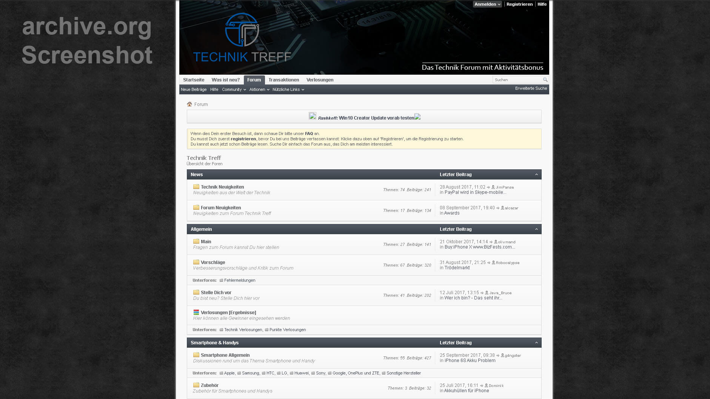
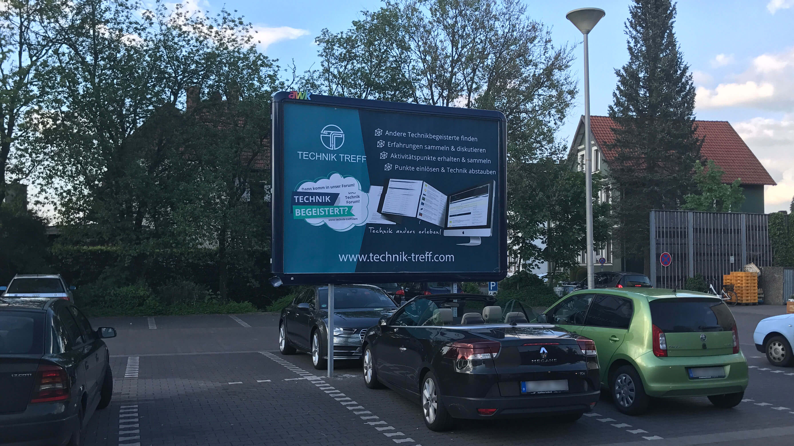
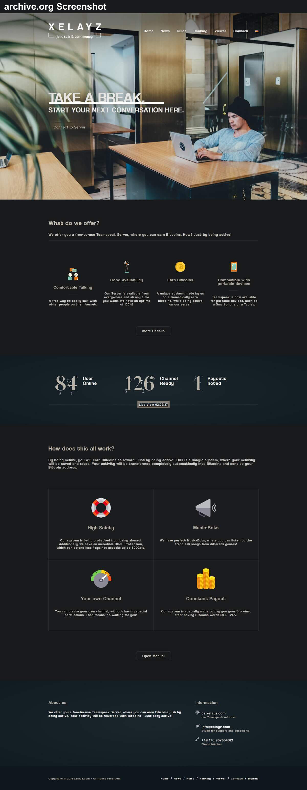
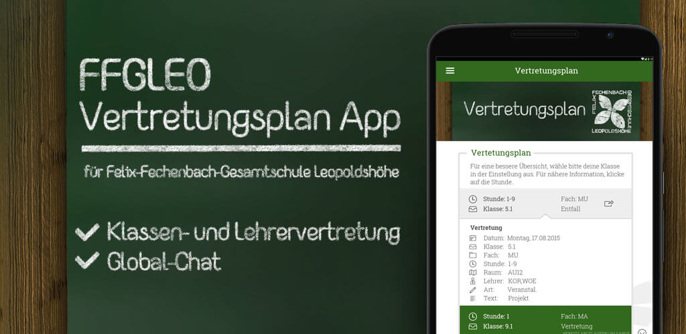
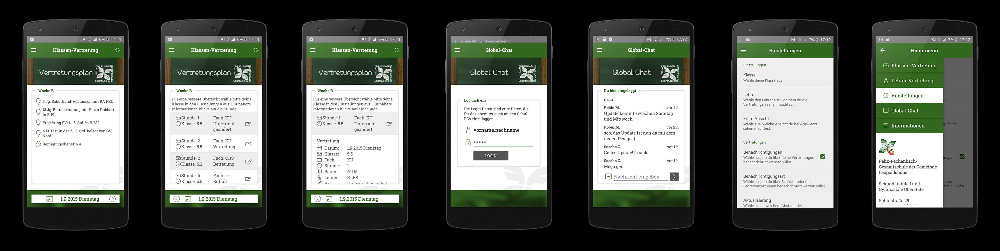
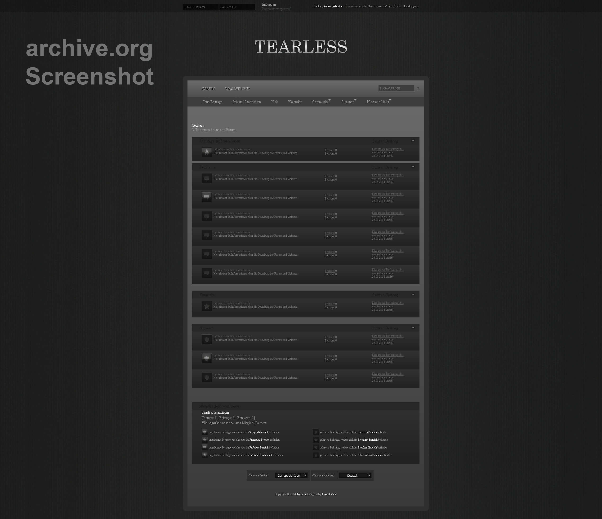

<!-- raw html -->

- ## Aktiv

  - ### App

  **2020 -> ∞** - Die meiste Aufmerksamkeit bekommt aktuell dieses Projekt. Dabei handelt sich um eine mobile App, welche unter iOS und Android laufen wird. Die Idee dafür hatte ich bereits Ende 2019, doch zu diesem Zeitpunkt hatte ich nicht den Fokus und die Zeit, um damit zu starten. Deshalb habe ich erst im Sommer 2020 mit der Recherche und Planung begonnen. Es wird sich um keine kleine App handeln, weshalb ich auch mit anderen Personen daran zusammenarbeite. Im ersten Quartal 2022 wird die App dann voraussichtlich veröffentlich werden. Vorher kann ich noch nicht bekannt machen, um was für eine App es sich handeln wird. Sobald es Neuigkeiten dazu gibt, sind diese hier zu finden.

  > **Links:** ... coming soon.

  - ### Tauschglück

  **2020 -> ∞** - Tauschglück ist ein gemeinnütziges Projekt, welches am Ende eine große Spendensumme erreichen soll, welche dann an drei unterschiedliche Organisationen gespendet wird. Dieses Geld soll durch das Hochtauschen von Gegenständen erreicht werden. Mich hat es schon immer sehr fasziniert, wie Personen sich von einer Stecknadel zu einem Auto oder gar einem Haus hochgetauscht haben. Mit Tauschglück gehe ich nun denselben Weg, nur eben für den guten Zweck.

  > **Links:**: [Webseite](https://tauschglueck.de/) | [Twitter](https://twitter.com/tauschglueck) | [Instagram](https://www.instagram.com/tauschglueck/)

  - ### WOT Band

  **2020 -> ∞** - Ein Schulfreund spielt in einer Band und vor einigen Jahren hatte sich die Band eine Webseite gewünscht. Da ich der Band ab und an sowieso ausgeholfen habe, habe ich mich schnell dazu bereit erklärt eine Webseite zu erstellen. Mit Hilfe von Wordpress haben wir schnell eine übersichtliche und funktionale Seite erstellt, welche damals noch bei Strato gehostet wurde. Durch ein paar Unstimmigkeiten mit Strato habe ich die Webseite dann aber auf meinen eigenen Server migriert. Aktuell wird die Webseite leider nur mit regelmäßigen Updates versorgt, da durch Corona keine (oder nur beschränkt) neuen Auftritte oder Veranstaltungen stattfinden können, wodurch dann neue mögliche Inhalte für die Webseite leider wegfallen.

  > **Links:** [Webseite](https://wot-band.com/) | [YouTube](https://www.youtube.com/channel/UCmrEEkjT7P7FdJNCZnCw5dg) | [Instagram](https://www.instagram.com/wot_band/) | [Facebook](https://www.facebook.com/WOT-108065347223160)

- ## Inaktiv

  - ### Technik Treff

  **2017 -> 2018** - Von 2017-2018 habe ich ein Technik Forum (vBulletin v4) betrieben. Da ich mich schon lange für Technik interessiere, kam mir irgendwann die Idee eine kleine oder sogar größere Community aufzubauen, mit welcher man sich über alle Technik Themen unterhalten hätte können. Obwohl 2017 bereits das Absterben der normalen Foren besiegelt war, erlangte das Forum eine Mitgliederzahl von über 200 Nutzern in wenigen Wochen. Nutzer erhielten durch Beiträge und Themen Punkte, mit welchen sie an monatlichen Verlosungen teilnehmen konnten. Zu gewinnen gab es dann Technik, wie etwa nagelneue Gaming-Kopfhörer. Zusätzlich wurde das Forum durch Artikel über aktuelle Technik Neuigkeiten gefüllt, welche von Gast-Redakteuren geschrieben wurden. Ich hatte viel investiert, um das Forum zu füllen und um mich mit ebenfalls technikinteressierten Nutzern dort auszutauschen. Selbst Plakate hatte ich drucken lassen, in der Hoffnung, dass ich mit diesen neue Nutzer gewinnen konnte. Viele Investitionen später wurde mir jedoch klar, dass ich das Projekt aufgeben muss, da Foren durch Reddit und Co. tatsächlich kaum noch Chancen haben.

  > **Links:** [Wayback Machine](https://web.archive.org/web/20180120061919/https://www.technik-treff.com/)

  

<strong>Bilder</strong>
 



- ### Teamspeak mit Aktivitätsbonus

  **2016 -> 2017** - Ich lasse schon seit Ewigkeiten einen Teamspeak Server unter der Subdomain ts.xelayz.com laufen. Im Sommer 2016 hatte ich mir dann vorgenommen diesen Server mit mehr Nutzern zu füllen, um eine Community aufzubauen. Meine Idee war, dass ich die Nutzer für ihre Aktivität belohne. Da ich auch bereits im Thema Kryptowährungen bewandert war, habe ich mich dafür entschieden die Nutzer mit Bitcoin zu belohnen. Mein Server überwachte jeden Nutzer anhand der Teamspeak Client ID und zeichnete deren Aktivität auf. Nutzer wurden bei Inaktivität zusätzlich automatisch von einem Bot in einen Channel verschoben, in welchem dann keine Aktivitätsaufzeichung mehr stattgefunden hatte. Der Server hat den Nutzern dann pro Minute einen Betrag an Bitcoins zugewiesen. Sobald dann eine gewisse Summe an Bitcoins erreicht wurde, wurden diese automatisch an die Bitcoin Adresse gesendet, welche der Nutzer zuvor seiner Teamspeak Beschreibung hinzugefügt hatte. Das Projekt lief gut, doch verschluckte am Ende zu viel Geld und es war nicht absehbar, wann sich das Projekt durch z. B. Werbung refinanzieren konnte. Aus diesem Grund habe ich das Projekt dann eingestellt.

  > **Links:** [Wayback Machine](http://web.archive.org/web/20160602000849/https://xelayz.com/) | [Teamspeak Server](ts3server://ts.xelayz.com?port=9987)

  

<strong>Bilder</strong>



- ### Vertretungsplan App

  **2015 -> 2016** - An meiner damaligen Schule, an der ich mein Abitur begonnen habe, wurden uns immer jeden Morgen die Vertretungen auf einen Bildschirm angezeigt. Irgendwann haben Schüler herausgefunden, dass auf den Bildschirmen nur eine Webseite angezeigt wurde, welche öffentlich zugänglich war. Dadurch konnten wir dann die Vertretungen und Ausfälle von unterwegs verfolgen. Nur leider wechselte die Webseite immer automatisch die Seiten, da es so viele Klassen und dementsprechend viele Einträge gab. Dann kam ich auf die Idee, dass man sich doch die Einträge von der Webseite schnappen könnte, um diese benutzerfreundlicher in einer App anzeigen zu können. Schnell wurde dieses Projekt geplant und umgesetzt. Schüler hatten dann die Möglichkeit ihre Klasse in den Einstellungen auszuwählen, um nur noch relevante Einträge angezeigt zu bekommen. Sobald es dann einen neuen Eintrag für die hinterlegte Klasse gab, wurde auch sofort eine Push-Benachrichtigung an das jeweilige Endgerät gesendet. Über den globalen Chat bestand außerdem noch die Möglichkeit sich mit anderen Personen auszutauschen. Die Anmeldung am Chat erfolgte über die Anmeldedaten der Schule, welche an den Schulserver zum Abgleich gesendet wurden, um den Nutzer zu verifizieren. Leider durfte die App dann nach einigen Monaten nicht mehr offiziell weiterbetrieben werden, obwohl die Schulleitung die Idee klasse gefunden hatte. Mir wurde erklärt, dass meine damalige Schule dem Schulministerium unterliege und sowas nicht offiziell von Schülern betrieben werden dürfte.

  > **Links:** [Apkpure](https://apkpure.com/ffgleo-vertretungsplan/com.ffgleo.vp)

  

<strong>Bilder</strong>
 



- ### Instagram Marketing

  **2015 -> 2019** - Selbstpräsentation findet auf Instagram und Co. schon seit vielen Jahren statt und daraus entwickelte sich ein ganz neuer Markt, welchen ich um 2015 herum sehr interessant fand. Selber habe ich mich nie ernsthaft auf Instagram präsentiert, es war einfach nie mein Ding. Mich hat es aber sehr gereizt selber für ein Profil Reichweite aufzubauen, um diese Reichweite dann bei Erfolg zu vermarkten. Anfangs musste ich mir erstmal Gedanken machen, welche Themen denn auf Instagram am besten ankommen und welcher Name sich für mein Vorhaben eignen würde. Entschieden habe ich mich dann für die Themen Hotels, Reisen, Technik und Autos. Mit dem Nicknameprefix "unreal\_" wollte ich die Zugehörigkeit dieser 4 Seiten klar machen und um diesem Projekt etwas mehr Stärke zu verleihen. Viele Stunden habe ich dann regelmäßig investiert, um die schönsten Bilder herauszusuchen und in einem Instagram Sheduler einzupflegen, damit diese Beiträge dann automatisch zu den besten Zeiten veröffentlicht werden. Die ersten Werbeanfragen kamen bereits nach kurzer Zeit, welche ich aber vorerst abgelehnt hatte, da diese frühen Promotions meinen damaligen Wachstum geschadet hätten. Auf dem Technik-Profil kam es dann mit einem größeren Technikhersteller zu der ersten Kooperation. Nach dieser Kooperation hatte ich nur noch sehr wenige weitere angenommen, da die vier Instagram-Profile immer mehr Zeit beanspruchten, welche ich dann irgendwann nicht mehr hatte. Ich habe das Projekt vernachlässigt, weshalb die Instagram-Profile seit 2019 komplett inaktiv sind. Das größte Profil, @unreal_hotels, wechselte im Jahr 2019 den Besitzer, welcher das Thema 'Hotels' jedoch nicht weitergeführt hatte. Kurz vor dem Ende der Instagram-Profile hatte ich noch angefangen eine Plattform zu betreiben, auf welcher ich selber, aber auch andere Kunden, ihre Instagram-Profile verwalten konnten. Der Fokus dieser Plattform lag auf der Automatisierung vieler Instagram Prozesse, um die Reichweite der Profile bestmöglich zu erhöhen. Ende 2019 wurde aber auch diese Plattform eingestampft, da Instagram es solchen Plattformen zur Automatisierung sehr schwer gemacht hatte. Das war am Ende dann nur noch ein Katz und Maus Spiel, welches mir dann am Ende zu viel wurde.

  > **Links:** [@unreal_worlwide](https://www.instagram.com/unreal_worldwide/) | [@unreal_performance](https://www.instagram.com/unreal_performance/) | [@unreal_tech](https://www.instagram.com/unreal_tech/)

- ### Tearless

  **2014 -> 2015** - Im Jahre 2014 war ich noch sehr jung und besuchte zu diesem Zeitpunkt die Realschule in meinem Ort. Zu dieser Zeit wurde ich auf eine Person aufmerksam, welche sich im echten Leben anders als die anderen verhalten hatte. Irgendwann habe ich diese Person dann im Internet unter einem Nickname gefunden, welcher auf vielen Plattformen ähnlich war. Auf der einen Plattform habe ich dann gesehen, dass diese Person schwierige und kritische Inhalte postet und repostet. Inhalte, welche üblicherweise Personen veröffentlichen, denen es psychisch sehr schlecht geht. Ich wollte dieser Person helfen, doch hatte mich nie getraut, diese Person darauf anzusprechen. Ich hatte aber weiterhin den Drang solchen Personen zu helfen, da mich das irgendwie betroffen machte. Stattdessen hatte ich mir in den Kopf gesetzt ein Forum zu erstellen, in welchem solche Personen anonym ihre Probleme veröffentlichen können, um von anderen Nutzern Hilfe zu erhalten. Leider war mein Einkommen damals sehr gering, lediglich 60€ im Monat durch Zeitungen austragen. Deshalb habe ich mich damals an einer älteren 'kostenlosen' vBulletin Version versucht, was aber schnell scheiterte, da ich damals mit der Komplexität von vB noch nicht klar kam. Ich wechselte aus diesem Grund zu WoltLab und kaufte mir tatsächlich auch eine legale Lizenz. Das Thema Design machte mir aber sehr zu schaffen, wodurch ich jemanden anheuern musste, der mir ein Design für mein Forum fertigstellt. Dies hat mich damals zwischen ca. 250-400€ gekostet, was zu diesem Zeitpunkt meine gesamten Ersparnisse waren. Auf jetziger Sicht war es das Geld überhaupt nicht wert, doch ich war damals noch sehr unwissend und war froh, dass mir jemand helfen konnte. Durch einen Wechsel in die Oberstufe an einer anderen Schule hat sich das Projekt jedoch leider aus zeitlichen Gründen und durch Veränderung meiner Lebensbedingungen im Sand verlaufen.

  > **Links:** [Wayback Machine](http://web.archive.org/web/2016*/tearless.net)

  

<strong>Bilder</strong>



- ### Sonstiges

  **2013 -> 2017** - Neben den zuvor genannten Projekten gab es noch weitere, welche ich hier jedoch aus den unterschiedlichsten Gründen nicht nennen kann oder möchte. Dies schließt Projekte ein, bei denen vorab ein Non-Disclosure Agreement vereinbart wurde oder Projekte, welche nie beendet wurden oder gescheitert sind.
